# Model Context Protocol (MCP) — The "Why"

> **One-line summary:** MCP is an emerging open standard that lets any AI chatbot connect to any external service through a unified "client–server" protocol, eliminating the explosion of custom integrations that plagued earlier function-calling approaches.

---

## Overview

MCP has become extremely popular over the past year, and many believe it will become an **industry standard within the next three to five years**, meaning virtually everyone building software will need to integrate it. Rather than diving into technical mechanics, this video takes a **storytelling approach** — starting from the launch of ChatGPT and tracing each problem and solution up to the present day — so that an intuition for *why MCP is necessary* develops deeply rather than being memorized as a fact.

The narrative arc is a chain of problems, each solution creating the next problem:

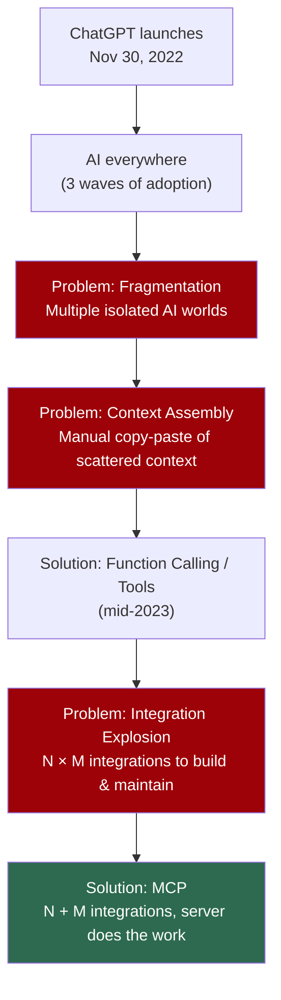

---

## The Beginning — ChatGPT and a New Class of Software

The story starts on **30 November 2022**, when ChatGPT was released. Within **five days** it crossed **1 million users**, and within the next **two months** it crossed **100 million users** — numbers no prior software (Google, Facebook, Twitter) had ever achieved that fast.

ChatGPT represented a **completely different class of software** — something that had never existed before. Its defining new capability: you could **talk to machines in natural language**, exactly as you would talk to a human.

### Why this was historically significant

Our relationship with machines is roughly **500–600 years old** (mechanical machines → electrical machines → computers over the last ~50 years), but for that entire span the relationship has been **transactional**:

> **Transactional relationship** = you perform a precise action and get a result back. Feel hot → flip the fan switch. Need a calculation → press calculator buttons. Need to fill a form → type and press a button.

ChatGPT changed this. You can now:
- Express yourself freely to the computer
- Have the machine express itself back
- Engage in a **thoughtful discussion**
- Make the computer a genuine **work partner**

---

## Three Waves of ChatGPT Adoption

Adoption did not happen all at once — it came in **three stages**.

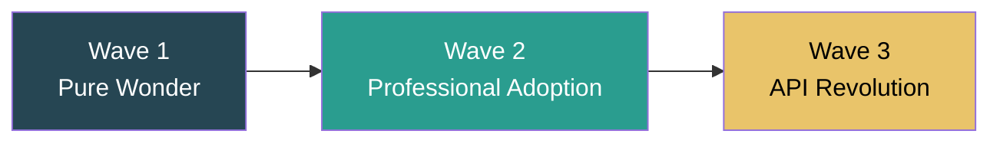

### Wave 1 — The Stage of Pure Wonder
People simply satisfied their **curiosity**, asking quirky questions:
- *"Explain quantum physics from a cat's perspective."*
- *"What would happen if gravity reversed?"*
- *"Write a song about pizza in Shakespeare's style."*

ChatGPT responded intelligently, people screenshotted the results and posted them across LinkedIn, Instagram, and WhatsApp. **Social media exploded.** No truly meaningful work happened yet — but curiosity was satisfied.

### Wave 2 — Professional Adoption
Once the novelty settled, a natural question arose: *Can this chatbot actually help with my professional work?* This was the first time:
- A **lawyer** pasted a 50-page contract and asked for a summary — and it worked.
- A **coder** pasted buggy code and asked *"Can you debug this?"* — and it worked.
- A **teacher** asked it to plan a curriculum — and it worked.

People **collectively realized** this wasn't just a toy — it had serious potential as a **work partner** that could double productivity. Tasks that took 6 hours might now take 3. The world experienced a **productivity boom**.

### Wave 3 — The API Revolution
OpenAI hadn't only released ChatGPT; it also released the **API for its GPT models** to the general public. Companies could now embed ChatGPT-like intelligence into their **existing software**:
- **Microsoft** added **Copilot** to Word, Excel, and PowerPoint.
- **Google** integrated AI into Gmail, Docs, Sheets, and Drive.
- New AI-first tools emerged like **Cursor** and **Perplexity**.

AI was no longer restricted to ChatGPT — it became far more **accessible**, appearing inside the software people already used.

---

## The Problem of Fragmentation

With AI now embedded everywhere, a new problem emerged — **the problem of fragmentation**.

We use many software tools daily, and after the API wave they all became AI-enabled. **But each AI is isolated:**
- Notion's AI has no idea what Slack's AI is doing.
- A VS Code coding assistant has no idea what's being discussed in Microsoft Teams.

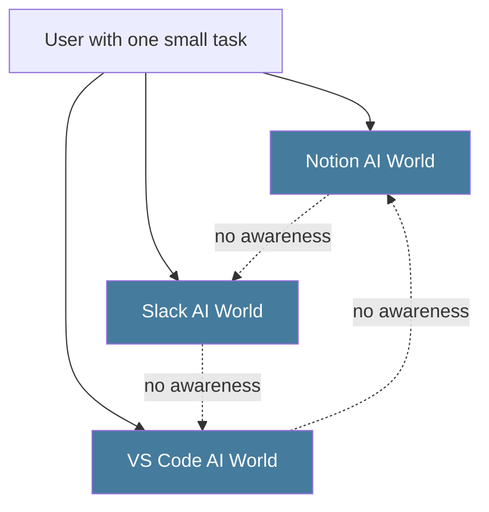

Suddenly we were living in **multiple AI worlds**. Even a small task required **juggling between them** — a bit of information here, a bit there — and manually merging it all.

### The vision vs. the reality

| What we *wanted* | What we *got* |
|---|---|
| One **unified AI agent** that understands our entire workflow end-to-end | **Five separate AI tools**, each doing a fragment of the work |
| An agent that could also **solve** any problem we got stuck on | Constant context-switching between disconnected assistants |

Building that unified AI agent is not easy, and the **single biggest obstacle** in its way is the **Problem of Context**.

---

## Understanding Context

**Context** is a *fundamental* concept in MCP — so fundamental that it's literally in the name: **Model _Context_ Protocol**.

> **Simple definition:** Context is *everything an AI can see when it generates a response.*
>
> **Formal definition:** Context refers to the information that the LLM uses to generate a response.

That information might be **conversation history**, **external documents**, and more.

### Simple example — Conversation history as context

```
User: What is quantum physics?
User: Where can I learn quantum physics?
User: Which are the good books?
User: How difficult is this particular topic to learn?  ← ambiguous on its own
```

How does ChatGPT know what *"this topic"* refers to? It scans the **conversation history**, realizes the user means quantum physics, and answers accordingly. Here, the **conversation history *is* the context.**

But context isn't always this simple — especially in **professional use cases**.

### Complex example — A software engineer's day

A developer at a startup (an ed-tech product where people buy courses, like Udemy) is assigned a task: **add Two-Factor Authentication (2FA)** to make the website more secure.

The context required is **scattered across many systems**:

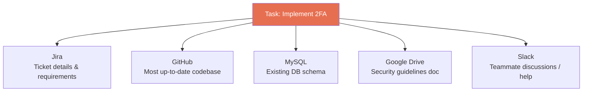

Unlike the simple example, here the context **co-exists in multiple places simultaneously**.

---

## The Problem of Context Assembly

Now imagine doing the 2FA task *with the help of ChatGPT*. The manual process:

1. Go to **Jira**, copy the ticket → paste into ChatGPT
2. Go to the **codebase**, copy 10–12 files of the existing auth system → paste
3. Go to **MySQL**, copy the schema → paste
4. Fetch the **security document**, copy specifications → paste
5. Copy relevant **Slack** discussions → paste
6. **~20 minutes later**, finally ask the first question: *"How to implement 2FA in such a system?"*

This reveals the core problem:

> Developers have effectively become **human APIs** — spending more time **assembling context** for the AI than actually **developing the product**.

You must also constantly track: *What context did I provide? What's missing? What did the AI forget? What needs summarizing?*

### Why this doesn't scale

- **Not scalable** — a codebase with 500+ files cannot be summarized or copy-pasted into ChatGPT.
- A real professional scenario has context spread **across systems**; copy-pasting it all into one place is *"a very, very difficult thing to do, and at scale it's not at all possible."*

> **The summarized problem:** For an AI chatbot to truly help, our **entire work must be part of its context**. But our work is **scattered**, and showing all of it to the AI manually (via copy-paste) is laborious and **fails as projects grow** and more tools are involved.

**Ideal solution:** What if ChatGPT-like software could **automatically fetch** the necessary context from all those places itself? That would eliminate the manual copy-paste entirely — and eventually, this problem *was* solved.

---

## The First Solution — Function Calling / Tools

In **mid-2023**, OpenAI released a simple but powerful concept: **Function Calling**.

> **Function Calling** lets your LLM **call an external function**. The LLM is no longer just for chatting — it can now **complete tasks**.

### How it works

You provide the LLM with a **set of functions**, each accompanied by a **description** of what it does. When a user's request matches a function's description, the LLM **invokes that function with the right arguments**.

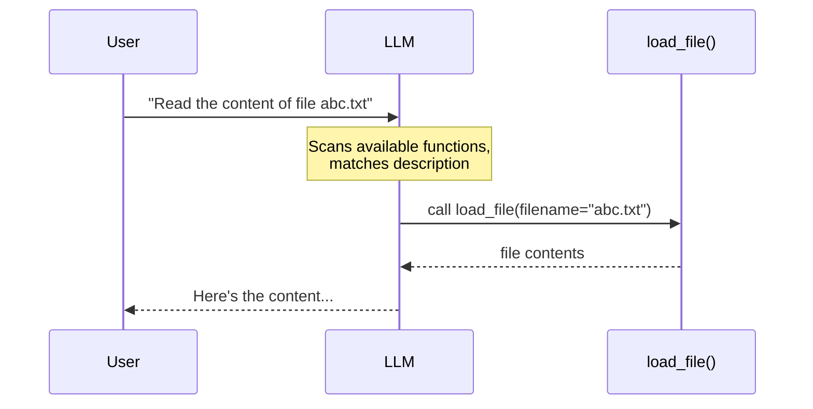

**Example setup:**

```python
# Give the LLM a function with a description
def load_file(filename):
    """Use this function whenever the user wants
    to load the content of a file."""
    # ... reads and returns file content
    return content
```

When the user says *"Read the content of file abc.txt"*, the LLM understands a **task** is being requested (not normal chat), scans the function list, matches `load_file`, and calls it with `filename="abc.txt"`.

This was **path-breaking** — for the first time you could not just chat with an LLM but **execute tasks** through it.

### The architecture that emerged

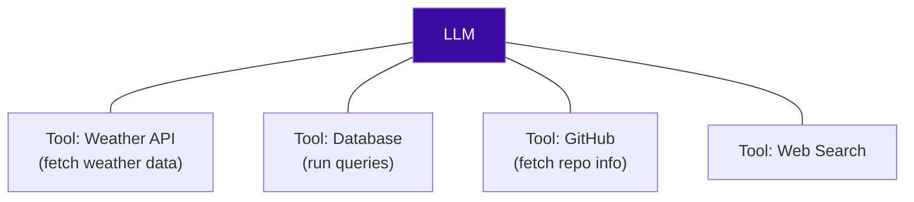

The LLM's only job is to **read the user's prompt and decide which tool to invoke**. Each function internally knows *how* to execute its task.

### The explosion of tools

After function calling arrived, tools "poured down like rain." Companies built tools to make context assembly seamless:

| Category | Examples |
|---|---|
| **Enterprise software tools** | Salesforce integration, Slack bot, Google Drive connectors, database query tools, GitHub integration |
| **Internal tools** | HR (employee data access), Finance (accounting systems), Marketing (campaign management), IT (infrastructure management) |
| **AI-first software tools** | Cursor (filesystem access), Perplexity (web browsing + real-time retrieval), ChatGPT Plus (browsing, file upload, code execution), Claude (Computer Use — full control of your computer) |

### How tools solved context assembly

Revisiting the 2FA task — but now **with tools connected**:

1. *"Go check whether I have a new ticket assigned on Jira."* → fetched automatically via the Jira tool
2. *"Fetch the most updated codebase from GitHub."* → fetched via GitHub tool
3. *"I need the schema for 2FA."* → fetched via MySQL tool
4. *"Fetch the security guidelines from Drive."* → fetched via Drive connector
5. *"What is my team discussing on Slack about this?"* → fetched via Slack tool
6. *"Now that you can see everything, tell me how to build a 2FA system."*

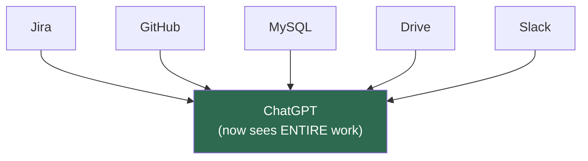

The scattered context was now **connected** to the AI. ChatGPT could **see the entire work** and therefore help properly. The context-assembly problem that blocked us from a unified AI partner was **solved by tools**.

---

## The Flaw — The Integration Explosion

For a few days, people thought context assembly was solved. But a **major flaw** soon appeared.

For every tool, you must write a **function** (with its own auth, data format, API pattern, error handling). The speaker references his own LangGraph playlist chatbot with **two tools**:

```python
# Tool 1 — Calculator
def calculator(...):
    """One function for the calculator tool."""
    ...

# Tool 2 — Stock price fetcher
def get_stock_price(...):
    """Another function for fetching a company's stock value."""
    ...
```

**Basic principle:** you must write a separate function's worth of code **for every single tool**.

### Why this becomes a nightmare at scale

Consider a company with **3 AI chatbots**:
- A normal company-Q&A chatbot
- A **coding agent** (for developers)
- An **analytics agent** (for data analysts)

…and **20 different SaaS tools** (Jira, Slack, GitHub, MySQL, Drive, + 15 more).

> **The math:** With **N** AI chatbots and **M** tools/services, you must code **N × M integrations**.
>
> Here: **3 × 20 = 60 functions** to write. In bigger companies these numbers grow even larger.

```mermaid
flowchart TD
    subgraph Chatbots
    C1["Chatbot 1"]
    C2["Chatbot 2"]
    C3["Chatbot 3"]
    end
    subgraph Tools
    T1["Tool 1"]
    T2["Tool 2"]
    T3["Tool ... 20"]
    end
    C1 --- T1
    C1 --- T2
    C1 --- T3
    C2 --- T1
    C2 --- T2
    C2 --- T3
    C3 --- T1
    C3 --- T2
    C3 --- T3
    style Chatbots fill:#1d3557
    style Tools fill:#1d3557
```

### The four problems of the N × M approach

| # | Problem | Explanation |
|---|---|---|
| 1 | **Development nightmare** | Every function needs its own auth method, data format, API patterns, and error handling. You'd need a *separate software team* just to build these integrations. |
| 2 | **Maintenance overhead** | With 60 functions, if Google Drive changes its API, **all** Drive integrations across all chatbots break — and must be re-debugged. |
| 3 | **Security fragmentation** | 60 integrations each with their own OAuth and API keys, stored in different files. Can't be managed from a single place → fragmented security → exploitable. |
| 4 | **Wasted cost & time** | Each integration takes time to code (a fully functional chatbot might take 2–3 months). You must hire and pay an entire team — **the irony:** you set out to make developers' work *easier*, but ended up hiring *more* developers and making it *harder*. |

### The summarized integration problem

> The core issue: **Every AI tool is building its own way to call every API.**

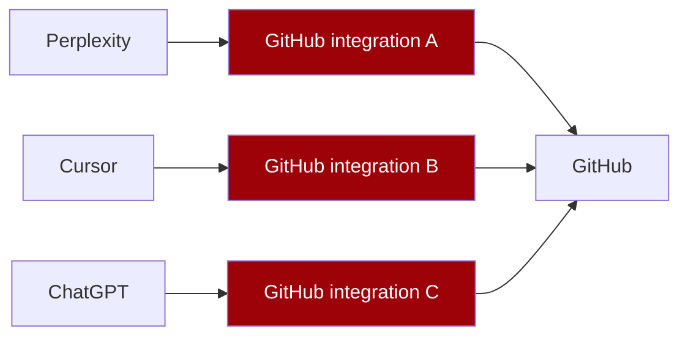

Three chatbots × GitHub = **three different integrations**, all looking different.

**What we want instead:** build **one single GitHub integration** that works with Perplexity, Cursor, *and* ChatGPT alike. This is exactly what MCP solves.

---

## MCP — The Solution

> Note: the speaker reuses the word **"tool"** for both (a) the function-calling functions and (b) the external services connected via MCP. In the MCP section, a "tool"/"server" generally means the external **service** (GitHub, Drive, Slack).

### Two entities: Client and Server

MCP has exactly **two entities**, and all communication flows between them:

| Entity | What it actually is | Examples |
|---|---|---|
| **Client** | Your **AI chatbot** | ChatGPT, Cursor, Perplexity, or your own custom chatbot |
| **Server** | The **service** you want to connect your AI to | GitHub, Google Drive, Slack |

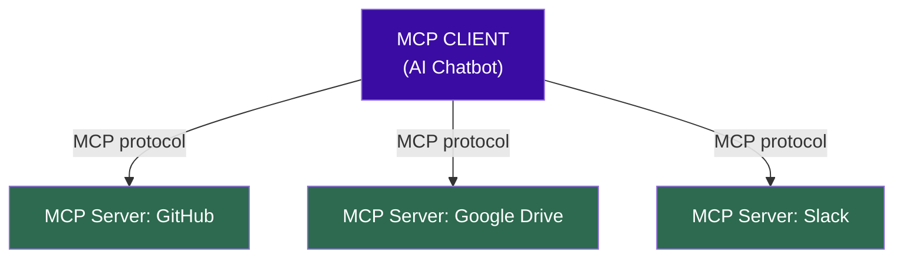

A **single client** connects to **many servers**. The **language** this client–server communication happens in *is* what we call **MCP (Model Context Protocol)**.

### How to make a client / server

You *could* read the MCP documentation and write all the protocol code from scratch. But **Anthropic provides ready-made SDKs**:

- To make your AI chatbot an **MCP-compatible client** → install the **MCP Client SDK** on the machine running your chatbot.
- To make your tools an **MCP-compliant server** → use the **MCP Server SDK** to build them.

> *Note: The transcript credits Anthropic with providing the MCP SDKs.*

---

## MCP vs. Function/Tool Calling — Technical Difference

### Function/Tool Calling

Both a server and a client exist, and **both pieces of code must be written and work together**:

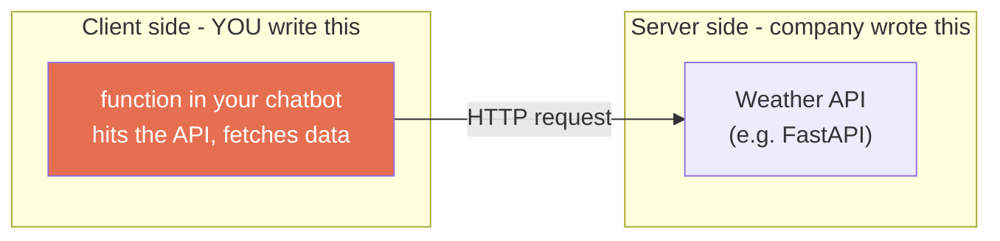

You write a function in your chatbot's code that **hits the API and fetches data** — that's the client side.

### MCP

A server still exists (built with the MCP library, internally still using the same underlying API). **The key difference is on the client side:**

> In MCP, you **don't need to write any code in your AI chatbot**. Since client and server are already configured/integrated and **speak the same language (MCP)**, all the work is handled by the server.

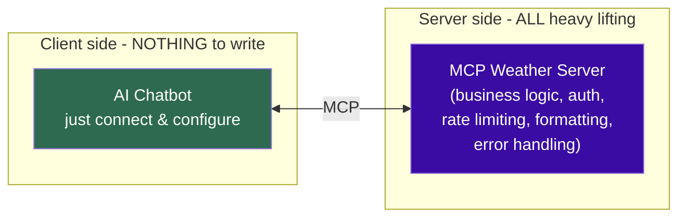

### Side-by-side comparison

| Aspect | Function / Tool Calling | MCP |
|---|---|---|
| **Server code** | Written by the company | Written by the service provider (using MCP Server SDK) |
| **Client code** | **You must write a function** for each tool | **Nothing** — just connect & configure |
| **Where the heavy lifting happens** | Split between client and server | **Entirely on the server** |
| **What the client does** | Hits APIs, parses data, handles errors | Simply connects and "speaks MCP" |
| **Business logic, auth, rate limiting, data-format translation, error handling** | Partly on client | **All on the MCP server** |

> **The major difference in one line:** In MCP, the **entire heavy lifting is done by the server**. On the client (AI chatbot) side you do **nothing** — you just maintain a config to connect.

---

## Benefits of MCP

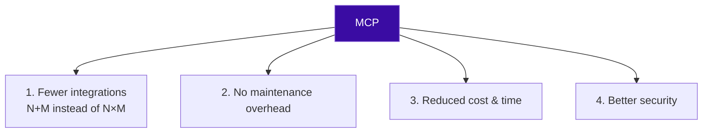

### 1. Fewer integrations: N + M instead of N × M
Famous providers (GitHub, Google Drive, Slack) built their **own official MCP servers**, so any MCP-compliant AI tool can connect easily.

- **Before:** 3 chatbots × 10 services = **30 unique integrations** (on the client side).
- **After:** connect to 10 MCP servers = just **10 integrations**, and those are written **on the server side** by the service provider. The client writes **zero** integration code.

> Formula shift: **N × M integrations → N + M integrations**, with the actual integration code **delegated to the server**.

### 2. No maintenance overhead
Since you write no connection code on your side, nothing can break there. If an API updates tomorrow, it's the **server's headache** — the server updates its code; the **client side sees no changes**.

### 3. Reduced cost & time
To connect to 10 services, you previously built 10 integrations (slow). Now you simply build the AI chatbot and connect to the **10 already-available servers on Day One** — getting their functionality immediately. Saves time, and saves cost because you don't hire extra engineers to create and maintain integrations.

### 4. Better security
Connecting to multiple services means maintaining a **single JSON config file** with all connections in one place, instead of scattered API keys across 10 files/tools.

```json
{
  "mcpServers": {
    "github": {
      "command": "...",
      "env": {
        "GITHUB_PERSONAL_ACCESS_TOKEN": "<your-token-here>"
      }
    },
    "notion": {
      "command": "...",
      "env": {
        "NOTION_API_KEY": "<your-key-here>"
      }
    }
  }
}
```

> *Illustrative config — the transcript describes a single JSON file holding all connections (e.g., a GitHub connection using a personal access token, a Notion connection using an API key). Managing/auditing one file is far simpler and more secure than 10 separate files.*

### Benefits summary table

| Benefit | Before (Function Calling) | After (MCP) |
|---|---|---|
| **Integration count** | N × M | N + M |
| **Where integration code lives** | Client side (you write it) | Server side (provider writes it) |
| **Maintenance** | You debug every API change | Server's responsibility; client unaffected |
| **Time to connect** | Weeks/months building integrations | Day One, servers already exist |
| **Cost** | Hire a dedicated integration team | No extra hires |
| **Security** | Fragmented keys across many files | Single auditable config file |

---

## Why MCP Is Growing So Fast — The Network Effect

Why is MCP's ecosystem growing explosively and likely to become an industry standard in 3–5 years? **A network effect.**

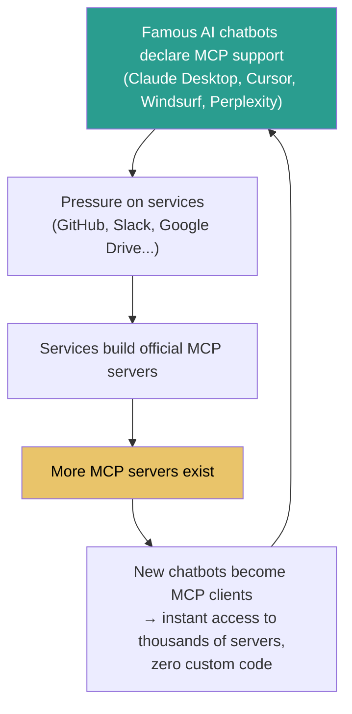

### The dynamic, step by step

1. **Clients adopt MCP.** Famous chatbots openly support it — *"We support MCP"* — including **Claude Desktop, Cursor, Windsurf, and Perplexity**.
2. **Pressure builds on services.** GitHub, Slack, Google Drive, etc. see that future users will do their work *through these AI tools*. Instead of opening `drive.google.com` to read a document, people will just tell their chatbot *"pull this document from my Drive."* So services build MCP servers — because once built, **any** MCP-compatible tool can connect with **no custom code**.
3. **More servers → more ecosystem value.** The more MCP servers exist, the more everyone benefits.
4. **New clients are pressured to join.** A brand-new chatbot only needs to become an MCP-compatible client, and on **Day One** it can connect to *thousands* of existing MCP servers **without writing any code**.

> **The flywheel:** More AI clients → more servers built → more pressure on new clients to be MCP-compliant → they auto-adopt MCP → ecosystem grows **exponentially.**

### The cost of *not* adopting MCP
If a client or server (any chatbot or tool) **doesn't** adopt MCP, it gets **cut off** from this massive ecosystem and must write tons of **custom code** to interact with every service — which would be foolish.

That's why MCP is **positioned perfectly** to become an industry standard within the next three to five years.

---

## Worked Example — The 2FA Task Across All Three Eras

| Era | How the developer assembles 2FA context |
|---|---|
| **Manual (no AI tools)** | Open Jira, pull from GitHub, study MySQL schema, fetch Drive doc, ask teammates on Slack — all by hand. |
| **Function Calling** | Tell ChatGPT to fetch from Jira/GitHub/MySQL/Drive/Slack via individually-coded tool functions. *Works, but each tool needed a hand-written function → N×M explosion.* |
| **MCP** | ChatGPT (an MCP client) connects to MCP servers for Jira, GitHub, MySQL, Drive, Slack via a single config. Fetches everything; you write **no integration code**. |

---

## Common Pitfalls / Gotchas

- **Confusing "client/server" with web infrastructure.** In MCP, **client = your AI chatbot** and **server = the external service**. It is *not* introducing new generic web concepts.
- **Thinking tools/function-calling "solved" context assembly.** They solved *fetching* context but introduced the **N × M integration explosion** — a worse problem at scale.
- **Underestimating maintenance.** With function calling, a single upstream API change breaks every chatbot's integration with that service. MCP pushes this burden to the server provider.
- **Fragmented security.** Scattering API keys across many integration files is a real attack surface; MCP centralizes them into one auditable config.
- **The hiring irony.** Trying to make developers' lives easier via custom integrations can require hiring *more* developers — defeating the original purpose.
- **Terminology overload.** The speaker uses "tool" for both function-calling functions *and* MCP-connected services. Track which sense is meant from context.
- **Assuming you must hand-write protocol code.** You *can*, but Anthropic's **MCP Client SDK** and **MCP Server SDK** do this for you.

---

## Key Concepts Worth Remembering

- **MCP = Model Context Protocol** — the *language* spoken between an AI chatbot (**client**) and an external service (**server**).
- **Context** = everything an AI can see when generating a response (conversation history, documents, external systems).
- **The problem chain:** Fragmentation → Context Assembly → Integration Explosion → **MCP**.
- **Function Calling (mid-2023)** let LLMs *execute tasks* by invoking described functions — but required **N × M** integrations.
- **The killer formula:** **N × M integrations → N + M integrations** with MCP.
- **In MCP, the server does ALL the heavy lifting** (business logic, auth, rate limiting, data formatting, error handling); the **client does nothing but connect**.
- **Client connection is just a JSON config file** — simpler and more secure than scattered keys.
- **Anthropic provides the MCP Client SDK and MCP Server SDK.**
- **Network effect** drives adoption: more clients → more servers → more pressure → exponential growth → likely **industry standard in 3–5 years**.
- **Not adopting MCP = being cut off** from the ecosystem and stuck writing endless custom code.

---

## Summary

ChatGPT introduced a new class of software — natural-language interaction with machines — and its rapid, three-wave adoption (wonder → professional use → API revolution) put AI inside nearly every tool we use. But this created **fragmentation** (isolated AI worlds) and the deeper **context-assembly problem**, where developers became "human APIs" manually copy-pasting scattered context into chatbots. **Function calling** solved the fetching problem by letting LLMs invoke tools, but at scale it exploded into **N × M custom integrations** that were a nightmare to build, maintain, secure, and afford. **MCP** resolves this by standardizing a client–server protocol where servers do all the heavy lifting and clients merely connect — collapsing integrations from **N × M to N + M**. Driven by a powerful network effect among AI clients and service providers, MCP is positioned to become an industry standard within the next three to five years.

---
