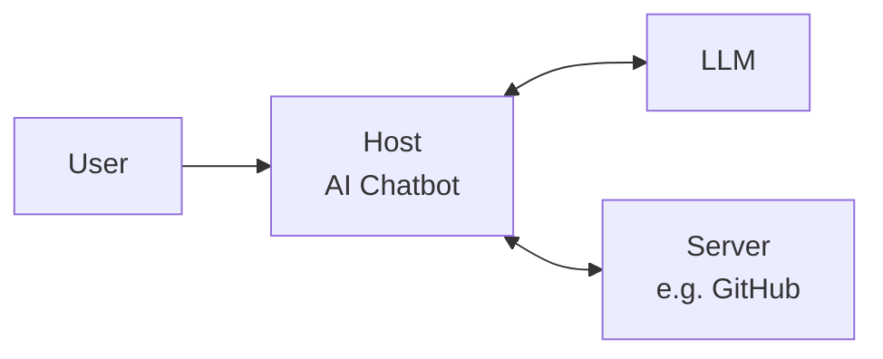
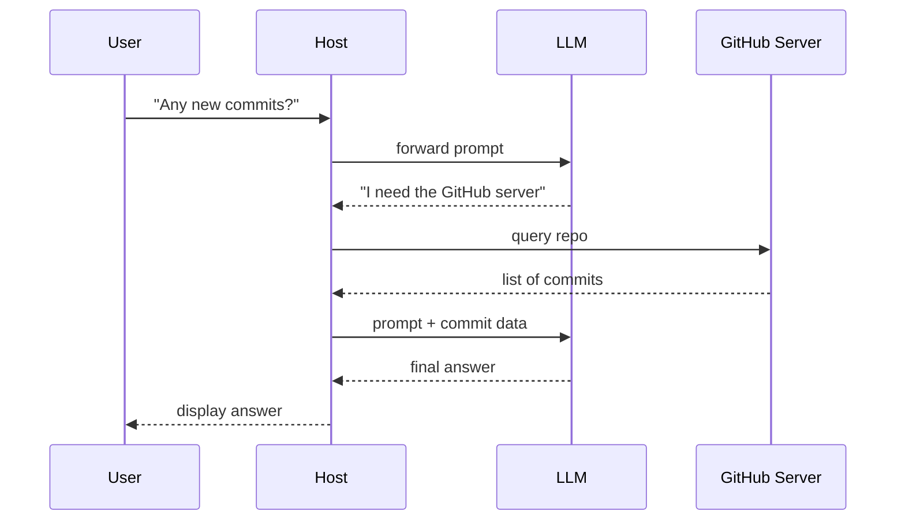
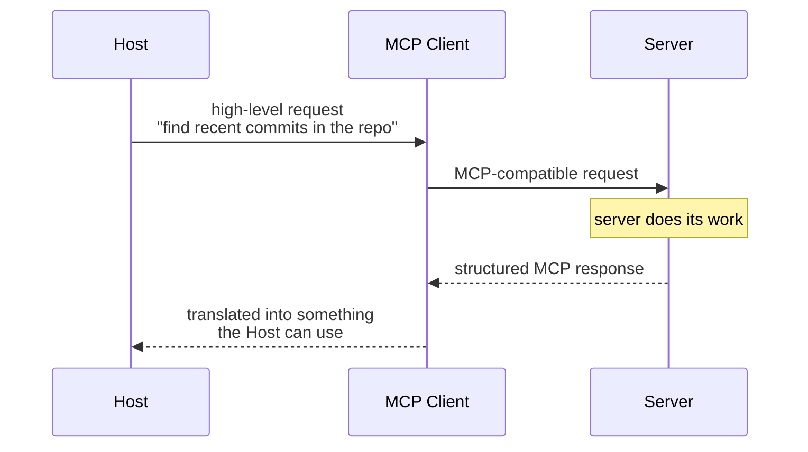
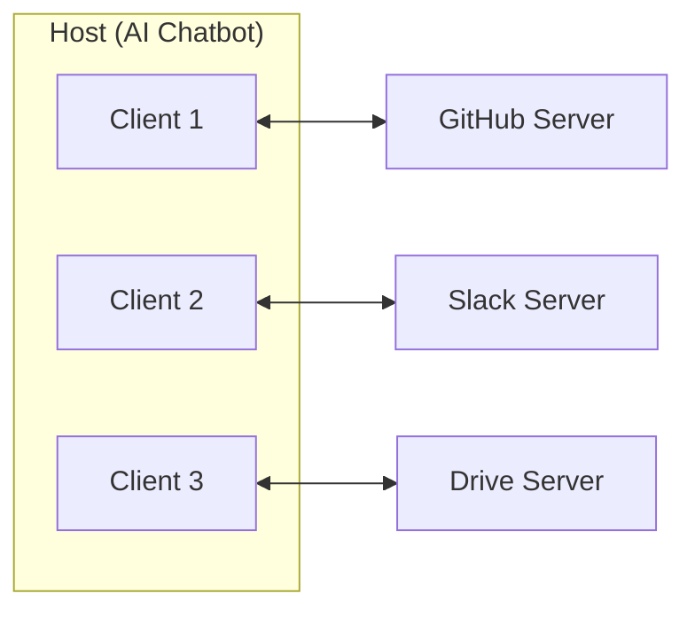
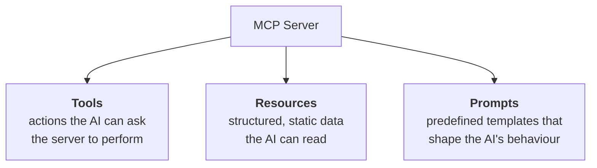
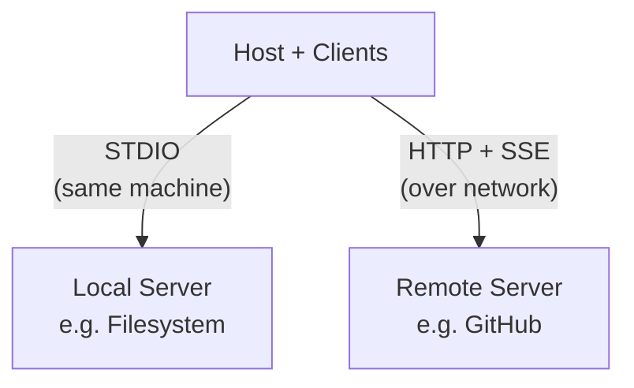
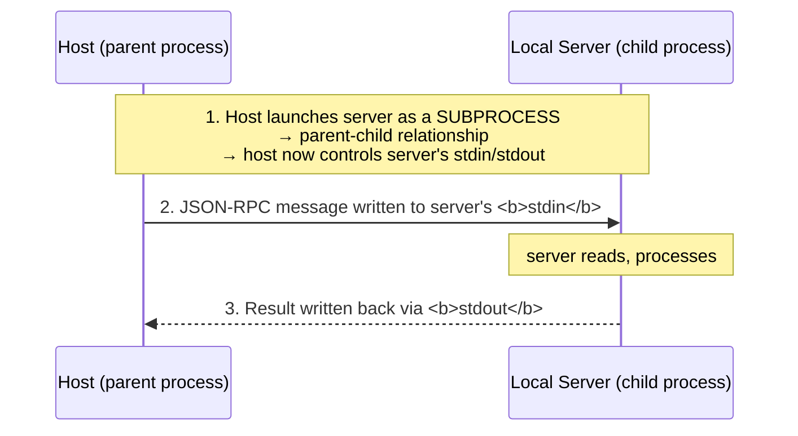
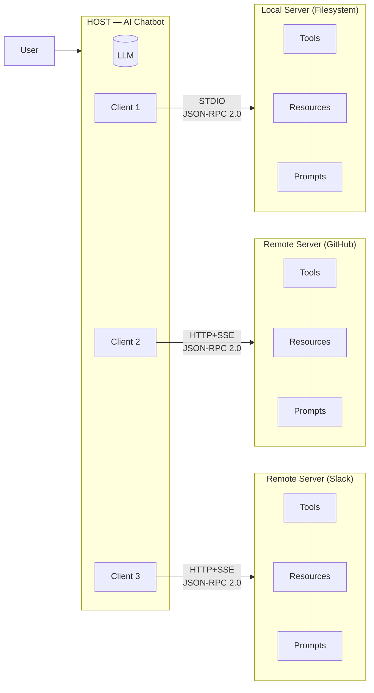
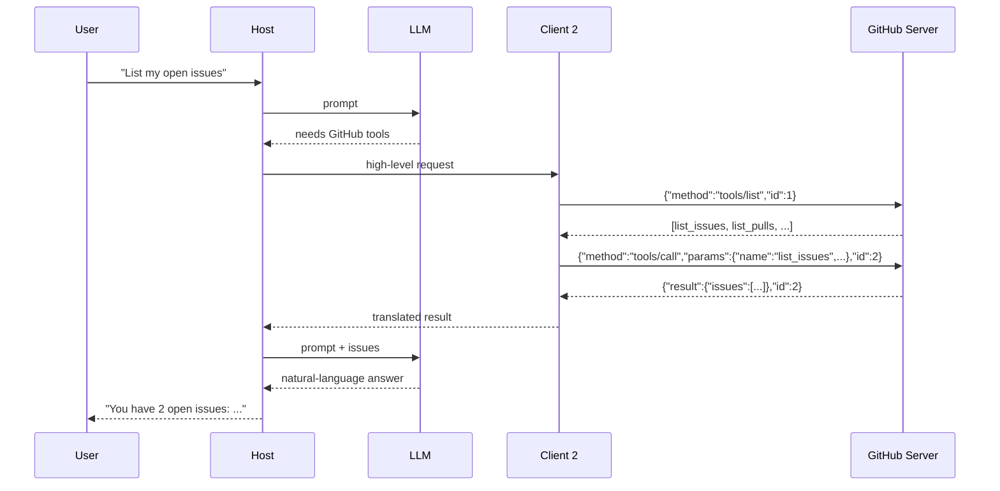

# MCP Architecture — Study Notes

> **One-line summary:** The Model Context Protocol (MCP) is a standard architecture that lets an AI chatbot (the *Host*) talk to external tools and data sources (*Servers*) through dedicated one-to-one *Clients*, using JSON-RPC 2.0 messages carried over either STDIO (local) or HTTP+SSE (remote).

---

## Overview

An LLM on its own is a closed box: it can only answer from training data. The moment a user asks *"Are there any new commits on my GitHub repo?"*, the model needs access to the outside world.

MCP is Anthropic's answer to that problem. Instead of every chatbot inventing its own bespoke integration for GitHub, Slack, Google Drive, a database, and so on, MCP defines a **shared protocol** so any host can plug into any server.

This note builds the architecture up **from first principles** — starting with the simplest possible two-box picture and adding one refinement at a time until the complete diagram is assembled.

The three big things to walk away with:

1. **The topology** — Host, Client, Server, and the one-to-one rule.
2. **Primitives** — Tools, Resources, Prompts, plus the standard operations that work on them.
3. **The two layers** — the *Data Layer* (JSON-RPC 2.0: what the messages look like) and the *Transport Layer* (STDIO / HTTP+SSE: how they physically move).

---

## Level 1 — The Simplest Version: Host + Server

At its crudest, MCP has just two entities.

| Entity | What it is |
|---|---|
| **Host** | The AI chatbot the user actually interacts with. Behind the scenes it is wired to an LLM (Anthropic, OpenAI, Gemini, …). Examples: Claude Desktop, Cursor IDE, or a custom chatbot you built yourself. |
| **Server** | A tool with the capability to execute some particular task. Examples: a GitHub server (manage repos), a Slack server (read/write channel messages), a Google Drive server (manipulate files). |



### Walked-through flow

User asks: *"Are there any new commits on the GitHub repo?"*

1. User sends the prompt to the **Host**.
2. Host forwards it as-is to the **LLM**.
3. LLM realises the answer is **not in its training data** → it needs an external tool.
4. LLM checks which servers are available, spots the GitHub server, and tells the Host: *"I don't know the answer — go ask the GitHub server."*
5. Host queries the **GitHub server**, which checks the repo and returns the list of new commits.
6. Host takes that information **back to the LLM**, which now has sufficient context.
7. LLM produces the final answer → Host renders it in the UI.



---

## Level 2 — Enter the Client

The picture above is **not quite true**. In reality:

> **The Host never talks to a Server directly.** Every single communication goes *via* a Client.

**The MCP Client** is the helper entity that sits inside the Host and knows how to speak the MCP language that the Server speaks. That shared vocabulary is exactly why communication is easy for it and impossible for the Host on its own.

### Revised flow



The Client is a **two-way translator**:
- Host's high-level intent → **MCP-formatted request**
- Server's structured MCP response → **something the Host/LLM can consume**

### The one-to-one rule

**A Client can be connected to exactly one Server at a time.**

If your Host needs GitHub *and* Slack *and* Drive, you don't reuse one client — you spin up **one client per server**.



### The phone / SIM analogy

| Real world | MCP |
|---|---|
| Your **phone** | Host |
| The **SIM card** | MCP Client |
| The **network** (Airtel / Jio / Vodafone) | Server |

Your phone can't talk to a mobile network directly — it needs a SIM. And one SIM binds to one network. Want three networks? Install three SIMs. Exactly the same shape as MCP.

### Why bother? Two benefits

| Benefit | What it means |
|---|---|
| **Decoupling** | Separation of concerns. The GitHub conversation knows nothing about the Slack conversation. If the GitHub channel breaks tomorrow, Slack and Drive keep working. This creates a *sense of safety* in the system. |
| **Scalability** | Because each server gets its own client, you can attach as many servers to one host as you like — just add one more client per server. Also lets you run tasks **in parallel** (fire a Slack task and a GitHub task simultaneously), which makes overall execution faster. |

---

## Level 3 — Primitives

> **Primitives are the things a Server can offer to a Host.**

There are exactly **three**.



### 1. Tools

**Actions the AI can ask the server to perform.** Anything *dynamic* / changing.

GitHub server tools might include:
- how many commits are in the repo
- how many active issues exist
- how many repositories are on the profile
- create an issue, push code, commit code

Google Drive server tools might include:
- search for a particular file or folder in your Drive
- create a new file in your account

### 2. Resources

**Structured data sources the AI can read.** Anything *static* / not changing.

- GitHub server → fetch the `README.md` of a repository
- Database server → fetch the schema of a database

> **The dividing line:** if the thing you want is **static** (doesn't change) → it's a **Resource**. If it's **dynamic** (commit count, issue count, repo count — all of which keep changing) → you fetch it with a **Tool**.

### 3. Prompts

**Predefined prompt templates and instructions the server offers to help shape the AI's behaviour.**

This is the confusing one, so here's the worked example.

**Problem.** User says: *"Create an issue for a bug — the login button doesn't work."*

The host asks the client which tool can create an issue → finds `create_issue`. The LLM then generates the text itself:

```text
title: login bug
body: the login button doesn't work
```

That's **vague**. Real GitHub issues should be far more descriptive. But the LLM was never given guidelines about the required format, so it improvised badly.

**Solution.** Store a prompt primitive on the *server*:

```json
{
  "name": "issue_report_prompt",
  "description": "Write clear, detailed GitHub issues",
  "messages": [
    {
      "role": "system",
      "content": "Always include: Title, Steps to Reproduce, Expected, Actual, Environment."
    }
  ]
}
```

Now the LLM reads the guideline and generates:

```text
Title: Bug in login button

Steps to reproduce:
  1. Open the login page
  2. Enter credentials
  3. Press the login button

Expected behaviour: user should be logged in
Actual behaviour: nothing happens
Environment: Chrome, macOS
```

> **The fundamental idea of the prompt primitive:** it's how an AI host *learns to use a server better*. It won't be useful in every case — it shines in specialised scenarios — but MCP gives you the option.

### Standard operations on primitives

MCP doesn't just define the primitives; it defines **standard functions** for dealing with them.

| Primitive | Operation | What it does |
|---|---|---|
| Tools | `tools/list` | Client asks the server: *what tools can you provide?* Returns every available function. |
| Tools | `tools/call` | *Please run this particular tool with these particular arguments.* |
| Resources | `resources/list` | What static documents are available on this server? |
| Resources | `resources/read` | Give me the content of this specific resource. |
| Resources | `resources/subscribe` | Notify me whenever this document changes. |
| Resources | `resources/unsubscribe` | Stop notifying me (you will no longer learn about changes). |
| Prompts | `prompts/list` | List all available prompt templates. |
| Prompts | `prompts/get` | Fetch one specific prompt template. |

---

## Level 4 — The Data Layer (JSON-RPC 2.0)

> **The Data Layer is the language and grammar of the MCP ecosystem that everyone agrees upon in order to communicate.**

We've been saying "client and server talk to each other in the MCP language" — the Data Layer is where we finally ask: *what does that language actually look like? What's its grammar? What are the rules?*

**The key fact:**

> **JSON-RPC 2.0 serves as the foundation of MCP's data layer.** JSON-RPC gives us the rules for writing the language of MCP.

### What is RPC?

**RPC = Remote Procedure Call.**

> A remote procedure call allows a program to execute a function on another computer as if it were local, hiding the details of network communication and data transfer. This abstraction makes it easy to build distributed applications.

In plain terms: you're writing a program on machine A, but the functions/dependencies/libraries it needs live on machine B. RPC lets you call them — and makes it *feel* like they're local.

```text
Instead of:      add(2, 3)
You send:        "please run `add` with parameters 2 and 3"
```

### What is JSON-RPC?

**JSON-RPC = a marriage between RPC and JSON.**

> JSON-RPC combines the concept of remote procedure calls with the simplicity of JSON, allowing developers to structure RPC requests and responses in a standardised JSON format.

Current version is 2 — hence **JSON-RPC 2.0**.

### Anatomy of a request

```json
{
  "jsonrpc": "2.0",
  "method": "add",
  "params": [2, 3],
  "id": 1
}
```

| Field | Meaning |
|---|---|
| `jsonrpc` | Which protocol/version this request uses |
| `method` | Name of the function to execute on the server |
| `params` | Arguments to call it with |
| `id` | Correlation ID — matched against the response so you know which reply belongs to which request |

**Success response:**

```json
{
  "jsonrpc": "2.0",
  "result": 5,
  "id": 1
}
```

The version must match, and the `id` coming back must equal the `id` sent — that's how the client knows the response is valid and which request it answers.

**Error response** (say `add` doesn't exist on the server):

```json
{
  "jsonrpc": "2.0",
  "error": {
    "code": -32601,
    "message": "Method not found"
  },
  "id": 1
}
```

Just like HTTP has `404` and `500`, JSON-RPC has **standardised error codes**.

> Think of it as a different flavour of a REST API: both do machine-to-machine communication, but REST uses verbs like GET/POST, while JSON-RPC uses named methods.

---

### JSON-RPC in MCP — worked scenarios

#### Scenario A: Discovering tools (`tools/list`)

First time the GitHub server is connected, the chatbot wants to know what's available.

```json
// Client → Server
{
  "jsonrpc": "2.0",
  "id": 1,
  "method": "tools/list"
}
```

No `params` — this method doesn't need any.

```json
// Server → Client
{
  "jsonrpc": "2.0",
  "id": 1,
  "result": {
    "tools": [
      { "name": "list_issues", "description": "List all issues in a repo" },
      { "name": "list_pulls",  "description": "List all pull requests" }
    ]
  }
}
```

> ⚠️ Real MCP messages carry more technical detail than this. These are **simplified skeletons** — the shape is right, the fields are trimmed.

#### Scenario B: Calling a tool (`tools/call`)

The `tools/list` response also tells the client **which parameters each function requires**, so the client already knows how to fill `arguments`.

```json
// Client → Server
{
  "jsonrpc": "2.0",
  "id": 2,
  "method": "tools/call",
  "params": {
    "name": "list_issues",
    "arguments": { "owner": "nitish", "repo": "mcp-demo" }
  }
}
```

```json
// Server → Client
{
  "jsonrpc": "2.0",
  "id": 2,
  "result": {
    "issues": [
      { "id": 101, "title": "Login button broken", "state": "open" },
      { "id": 102, "title": "Docs typo",           "state": "open" }
    ]
  }
}
```

#### Scenario C: Resources

```json
// list
{ "jsonrpc": "2.0", "id": 3, "method": "resources/list" }

// read
{
  "jsonrpc": "2.0",
  "id": 4,
  "method": "resources/read",
  "params": { "uri": "repo://nitish/mcp-demo/README.md" }
}
```

The read response carries the URI back plus the document's text content.

#### Scenario D: Batching

JSON-RPC lets you send **multiple requests at once** — wrap them in a list. The server merges the responses.

```json
[
  { "jsonrpc": "2.0", "id": 5, "method": "tools/call",
    "params": { "name": "list_issues", "arguments": { "repo": "mcp-demo" } } },
  { "jsonrpc": "2.0", "id": 6, "method": "tools/call",
    "params": { "name": "list_pulls",  "arguments": { "repo": "mcp-demo" } } }
]
```

#### Scenario E: Notifications

Either side can send a notification — client → server or server → client.

| | Request/Response | Notification |
|---|---|---|
| Reply required? | **Yes** — for every request there *has to be* a response | **No** — fire and forget |
| Has `id`? | Yes (for correlation) | **No** — because no reply is coming back |

This is what makes `resources/subscribe` work: once subscribed, the server pushes a notification whenever the document changes.

```json
{
  "jsonrpc": "2.0",
  "method": "notifications/resources/updated",
  "params": {
    "uri": "repo://nitish/mcp-demo/README.md",
    "updatedBy": "nitish",
    "updatedAt": "2025-01-14T10:22:00Z"
  }
}
```

Note the **absent `id`** — the giveaway that it's a notification.

#### Scenario F: An error in practice

Client calls `list_issues` but only passes `owner`, forgetting `repo`:

```json
{
  "jsonrpc": "2.0",
  "id": 7,
  "error": {
    "code": -32602,
    "message": "Missing required field: repo"
  }
}
```

Obviously — the server can't know *which* repository's issues you wanted.

---

### Why JSON-RPC and not REST? (5 reasons)

Anthropic could have just used REST APIs — a GET endpoint does "call a function on a remote machine" perfectly well. Here's why they didn't.

| # | Reason | Explanation |
|---|---|---|
| 1 | **Lightweight** | REST rides on HTTP, so every request drags along headers and metadata. That's effortful to construct, effortful to debug, and heavier/costlier to send. A JSON-RPC request is just a small JSON object — no headers, no metadata. Easy to write, easy to debug, easy to ship over any transport. |
| 2 | **Bidirectional** | REST is one-way: client requests, server responds, always. JSON-RPC supports true two-way communication — the **server can initiate a request to the client** and the client responds. |
| 3 | **Transport-agnostic** | REST is welded to HTTP. JSON-RPC defines no fixed transport — it works over HTTP, STDIO, WebSockets, or even a custom transport you write yourself. |
| 4 | **Batching** | REST sends one request at a time; a second request means doing the whole thing again. JSON-RPC batches many calls into one message — extremely common in AI workflows. |
| 5 | **Notifications** | REST is strictly one-request-one-response. JSON-RPC lets you fire a notification with no reply expected. |

(There are more reasons in the spec — these are the five main ones.)

---

## Level 5 — The Transport Layer

> **The Transport Layer is the mechanism that moves JSON-RPC messages between the client and the server.**

The Data Layer answered *what the messages say*. The Transport Layer answers *how they physically get there*.

### Two types of server

| | **Local Server** | **Remote Server** |
|---|---|---|
| Definition | Runs on the **same computer** as the host — installed on the host's machine | Installed on **another computer**, on a network or the internet |
| Example | Filesystem server ("is there a Python file on my desktop?") | GitHub server ("list my top 5 starred repos") |
| Transport | **STDIO** | **HTTP + SSE** |

A filesystem server *has* to be local — otherwise it couldn't possibly know which folder on your machine holds which file.



---

### Local servers → STDIO

**STDIO = Standard Input / Output.** The built-in streams every program has:

- **stdin** — how the process receives input from the external world (e.g. keyboard)
- **stdout** — how the process sends output to the external world (e.g. monitor)

MCP uses these very cleverly as a transport between client and server, in **three steps**:



#### The demo that makes it click

You already do this every day. Take `hello.py`:

```python
name = input("Enter your name: ")
print(f"Hello {name}")
```

Run it:

```bash
$ python3 hello.py
Enter your name: Nitish
Hello Nitish
```

Map it onto the three steps:

| Step | In the terminal demo |
|---|---|
| 1. Host launches server as a subprocess | The **terminal** (host) launches **`hello.py`** (server) as a child process, and thereby gains control of its stdin/stdout |
| 2. Host writes to server's stdin | Typing `Nitish` and pressing Enter sends that message straight into the Python process |
| 3. Server writes back via stdout | `Hello Nitish` travels back to the terminal |

That is **exactly** what Claude Desktop does with a local filesystem MCP server: it starts the server behind the scenes, writes a JSON-RPC request into its stdin, the server does the work and pushes the output back out through stdout. The whole thing works *because of the parent-child relationship*.

#### Benefits of STDIO

| Benefit | Why |
|---|---|
| **Very fast** | Two processes on literally the same machine exchanging data — no data centre in the US, no network hop. They're directly connected because one process started the other. |
| **Very secure** | No network ports were opened at all. Everything happens on one machine, so an attack over the wire isn't possible. |
| **Simple to implement** | Every programming language supports stdin/stdout out of the box, so it took very little effort to build into MCP. |

---

### Remote servers → HTTP + SSE

**Why HTTP?** It is the most popular application protocol on the internet. Using it, the host can reach a server *anywhere in the world*.

**How the message travels:**

- The host sends an HTTP **POST** request to the server.
- The body carries a **JSON payload**, and inside that payload sits the **JSON-RPC message**.

```http
POST /mcp HTTP/1.1
Host: github-mcp.example.com
Authorization: Bearer <api-key>
Content-Type: application/json

{
  "jsonrpc": "2.0",
  "id": 1,
  "method": "tools/list"
}
```

**Bonus:** because we're on HTTP, every standard HTTP authentication method is available for free — API keys, bearer tokens, and so on.

#### What is SSE?

**SSE = Server-Sent Events**, an extension of HTTP, used for **streaming**.

> Technically, SSE lets the server send **multiple messages to the client over a single open connection**.

Instead of sending one big JSON blob at the end, the server starts streaming data **chunk by chunk** as each piece becomes ready — which is why AI responses appear to type themselves out. Better user experience.

```text
event: message
data: {"jsonrpc":"2.0","id":1,"result":{"chunk":"Analysing repo..."}}

event: message
data: {"jsonrpc":"2.0","id":1,"result":{"chunk":"Found 12 issues..."}}

event: message
data: {"jsonrpc":"2.0","id":1,"result":{"done":true}}
```

**Ideal for:**
- **long-running tasks** — e.g. an agent performing a series of tasks that will take a while
- **incremental updates** — pushing progress to the user as things happen on the server

Both are extremely common in the AI world.

---

### Payoff: why transport-agnosticism actually mattered

Now the earlier claim makes sense. We used **two completely different transports** — STDIO for local, HTTP+SSE for remote — but the **message format stayed identical**: JSON-RPC 2.0. JSON-RPC simply doesn't care how it's carried.

Had Anthropic chosen REST instead:
- Remote servers → fine.
- Local servers → **broken**. You'd have to set up a web server on your own machine just to talk to a local process. Hectic, and a lot of additional complexity for nothing.

And if some future transport (WebSockets, say) becomes necessary, JSON-RPC will work with that too.

> **This is the brilliance of MCP's architecture: the Data Layer and the Transport Layer are separated.** Swap the transport tomorrow and you change *nothing* in the data layer.

---

## The Complete Architecture



---

## Comparison Tables

### Host vs Client vs Server

| | **Host** | **Client** | **Server** |
|---|---|---|---|
| Role | The AI chatbot the user talks to | Translator/connector | Capability provider |
| Speaks MCP? | No | **Yes** | **Yes** |
| Talks to LLM? | Yes | No | No |
| Cardinality | 1 host : many clients | **1 client : 1 server** | 1 server : 1 client |
| Analogy | Phone | SIM card | Mobile network |

### Tools vs Resources vs Prompts

| | **Tools** | **Resources** | **Prompts** |
|---|---|---|---|
| Purpose | Perform an action | Read static data | Guide the AI's behaviour |
| Data nature | **Dynamic** | **Static** | Template/instruction |
| GitHub example | `create_issue`, `list_commits` | `README.md` | "issue report format" template |
| Operations | `tools/list`, `tools/call` | `resources/list`, `/read`, `/subscribe`, `/unsubscribe` | `prompts/list`, `prompts/get` |

### JSON-RPC vs REST

| Feature | **JSON-RPC 2.0** | **REST API** |
|---|---|---|
| Weight | Lightweight, no headers/metadata | Heavy — HTTP headers + metadata |
| Direction | **Bidirectional** | One-way (client → server) |
| Transport | **Agnostic** (STDIO, HTTP, WebSocket, custom) | Locked to HTTP |
| Batching | **Supported** | One request at a time |
| Notifications | **Supported** (no reply expected) | Not supported — 1 request, 1 response |
| Style | Named methods (`tools/call`) | Verbs + URLs (GET/POST/PUT) |

### STDIO vs HTTP+SSE

| | **STDIO** | **HTTP + SSE** |
|---|---|---|
| Used for | Local servers | Remote servers |
| Mechanism | Parent/child process; write to stdin, read from stdout | POST with JSON payload; SSE for streaming replies |
| Speed | Very fast (same machine) | Network-bound |
| Security | Very secure — **no ports opened** | Needs standard HTTP auth (API keys, tokens) |
| Streaming | N/A | **Yes** — chunk by chunk over one open connection |
| Implementation | Very simple — every language supports it | Requires networking + auth setup |

### Request vs Notification

| | **Request** | **Notification** |
|---|---|---|
| `id` field | Present | **Absent** |
| Response | **Mandatory** | None — fire and forget |
| Use case | `tools/call`, `resources/read` | Resource-changed pushes after `subscribe` |

---

## Worked Examples

### Example 1 — End-to-end: "List my open issues"



### Example 2 — Local filesystem server in action

```text
User → Claude Desktop:  "Is there a Python file on my desktop?"

  → Claude recognises it must use the filesystem server
  → permission prompt shown to user
  → JSON-RPC request written to server's stdin
  → server scans the desktop
  → result returned via stdout

User → Claude Desktop:  "List down all the folders on my desktop"
  → same flow, permission requested again, folders listed
```

Note in the transcript's live demo the first query **missed** a `hello.py` that the second query found — a good reminder that tool results are not infallible.

### Example 3 — Prompt primitive, before and after

```diff
- title: login bug
- body: the login button doesn't work

+ Title: Bug in login button
+ Steps to reproduce:
+   1. Open login page
+   2. Enter credentials
+   3. Press login button
+ Expected: user should be logged in
+ Actual: nothing happens
+ Environment: Chrome, macOS
```

Same user request. The only change: a **guideline stored on the server**.

---

## Common Pitfalls / Gotchas

- **Saying "the Host talks to the Server."** It doesn't — *ever*. Every low-level exchange goes through a Client.
- **Reusing one Client for multiple Servers.** Impossible. The relationship is strictly **one-to-one**. Three servers → three clients.
- **Confusing Host and Client.** The Host is the whole chatbot application; the Client is a component *inside* it, one per server.
- **Putting dynamic data in Resources.** Commit counts, issue counts, repo counts all change — those belong to **Tools**. Resources are for static things like a README or a DB schema.
- **Forgetting the `id` must match.** The client validates the response by matching the returned `id` to the one it sent. Notifications deliberately omit it — if you see a message with no `id`, no reply is expected.
- **Expecting a reply to a notification.** Fire and forget. The other side just observes.
- **Assuming a Prompt primitive is always useful.** It helps in specialised cases where output format matters; it's an option, not a requirement.
- **Assuming REST could have done the job.** It handles remote servers fine but falls apart for local ones — you'd need a local web server, which adds needless complexity.
- **Expecting to hand-write JSON-RPC.** In practice, libraries handle all of this internally. Learn it for the *conceptual* understanding (and interviews), not because you'll type it.
- **Treating the simplified JSON in notes/tutorials as the real wire format.** Actual MCP messages carry more technical detail; only the skeleton matches.

---

## Key Concepts Worth Remembering

- **Host = AI chatbot. Client = translator. Server = capability provider.**
- **Phone : SIM : Network** = **Host : Client : Server**.
- **The Host never speaks to a Server directly** — always via a Client.
- **Client ↔ Server is strictly 1:1.** N servers → N clients.
- **Two architectural benefits:** *decoupling* (safety, separation of concerns) and *scalability* (parallelism, unlimited servers).
- **Three primitives:** **T**ools (actions, dynamic), **R**esources (static data), **P**rompts (behaviour templates). — *"TRP"*
- **Static → Resource. Dynamic → Tool.**
- **Standard operations:** `tools/list`, `tools/call`; `resources/list|read|subscribe|unsubscribe`; `prompts/list|get`.
- **Data Layer = JSON-RPC 2.0** — the grammar of MCP. Fields: `jsonrpc`, `method`, `params`, `id`.
- **JSON-RPC = RPC + JSON.** RPC = call a remote function as if it were local.
- **5 reasons for JSON-RPC over REST:** lightweight, bidirectional, transport-agnostic, batching, notifications.
- **No `id` = notification = no response expected.**
- **Transport Layer = how JSON-RPC messages move.** Two server types, two transports:
  - **Local server → STDIO** (fast, secure, simple; parent/child processes)
  - **Remote server → HTTP + SSE** (global reach, standard auth, streaming)
- **STDIO in three steps:** host launches server as subprocess → writes to its stdin → reads from its stdout.
- **SSE = many messages over one open connection** — for long-running tasks and incremental updates.
- **The core design win: Data Layer and Transport Layer are decoupled.** Change the transport, change nothing else.

---

## Summary

MCP's architecture is a **Host** (an AI chatbot backed by an LLM) that connects to any number of **Servers** (GitHub, Slack, Drive, filesystem, databases) — but never directly, always through one dedicated **Client** per server. Each server exposes three kinds of offering, its **primitives**: Tools for actions, Resources for static data, and Prompts for shaping how the AI uses the server, each with its own set of standard operations like `tools/list` and `tools/call`.

Everything the client and server say to each other is written in **JSON-RPC 2.0** — the *Data Layer* — chosen over REST because it's lightweight, bidirectional, batchable, notification-capable, and, crucially, **transport-agnostic**. That last property lets the *Transport Layer* differ by server type: local servers ride **STDIO** via a parent/child process relationship (fast, secure, trivially simple), while remote servers ride **HTTP + SSE** (global reach, standard auth, streaming responses).

The clean separation between what the messages say and how they travel is the single most important design decision in MCP: swap the transport tomorrow and the data layer never has to know.
