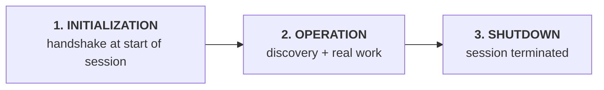
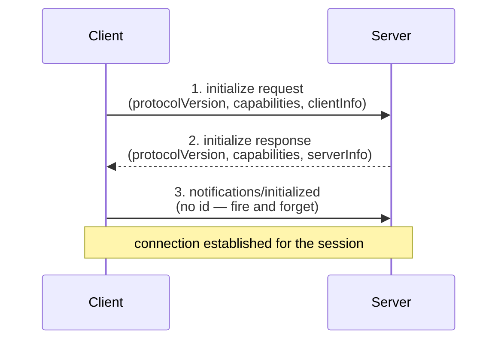
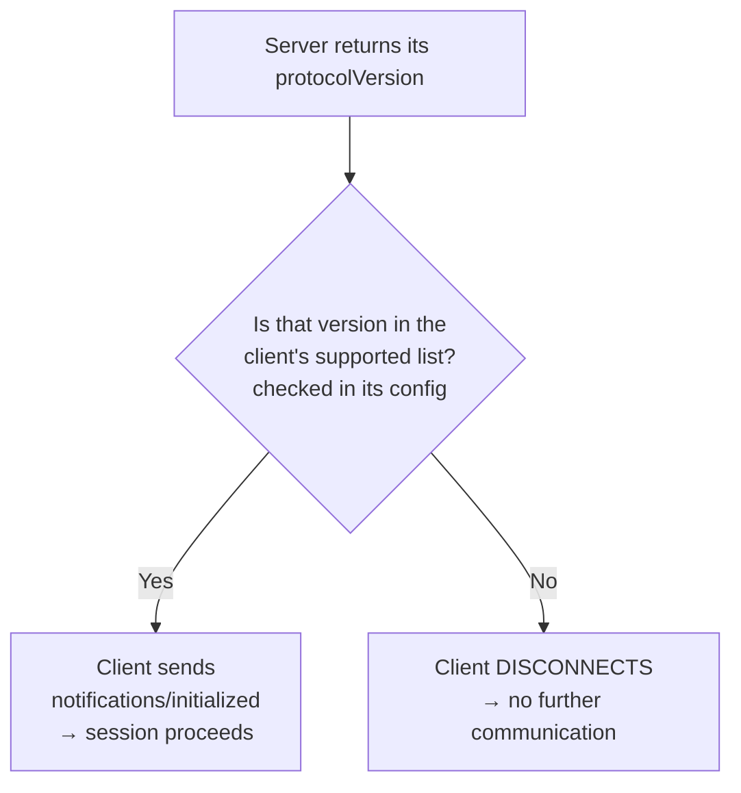
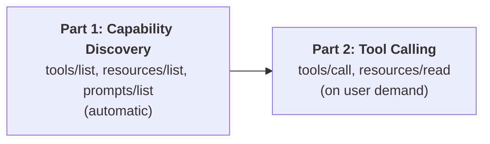
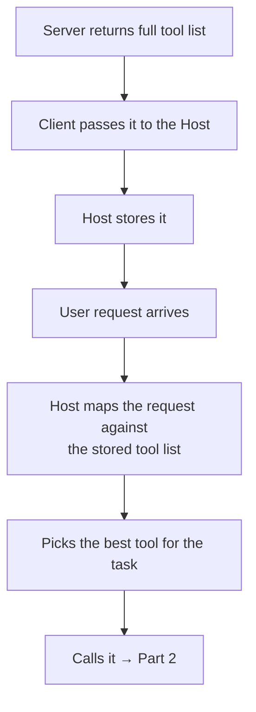
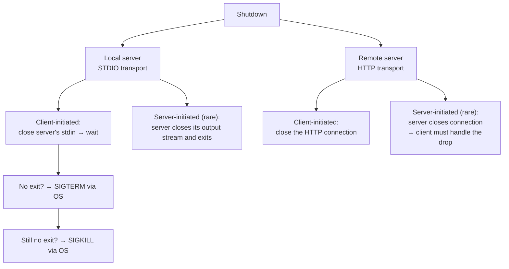
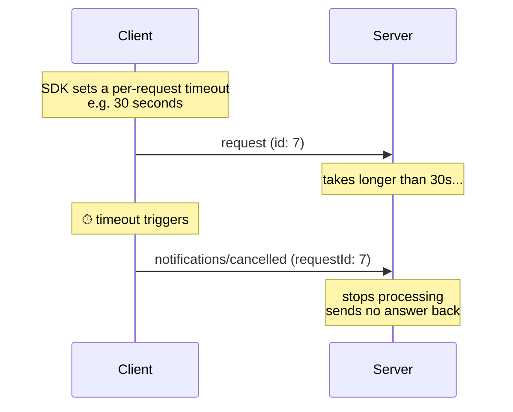
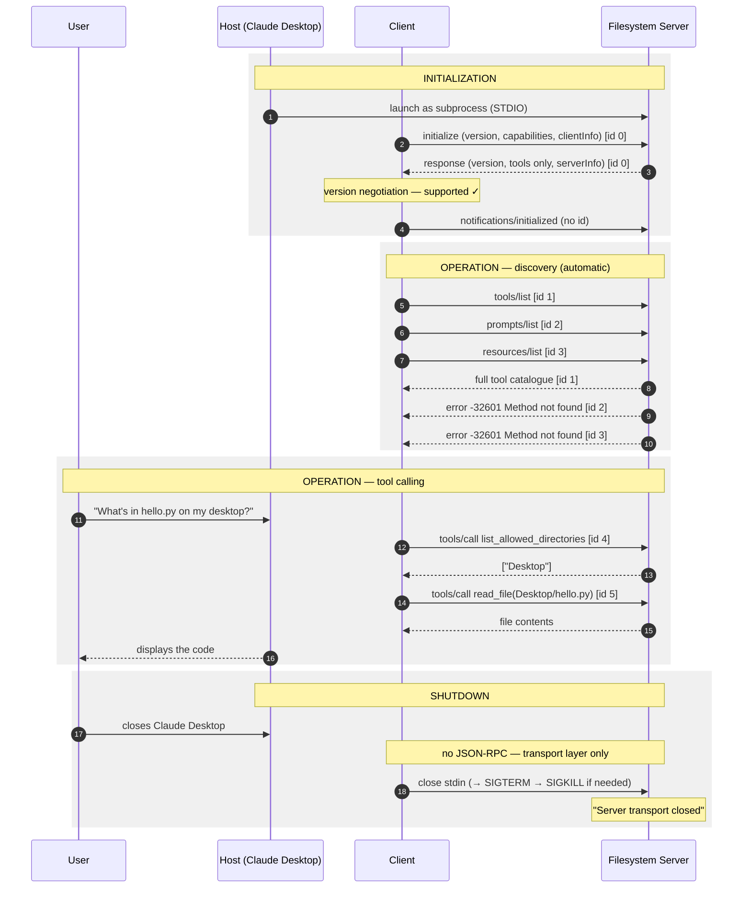

# MCP Lifecycle — Study Notes

> **One-line summary:** The MCP Lifecycle is the complete, ordered sequence of steps that governs how a Host and a Server establish, use, and end a connection during a session — Initialization → Operation → Shutdown.

---

## Overview

The previous topic (MCP Architecture) answered **what the pieces are**: Host, Client, Server, primitives, JSON-RPC data layer, STDIO/HTTP transports.

The Lifecycle answers **how those pieces actually work together, step by step, in what order** — the rule book that makes MCP function correctly.

This matters practically: when you sit down to write your own MCP server or client, this is the flow your code has to implement. Everything here is observable — you can open Claude Desktop's logs and literally watch the JSON-RPC messages fly past.

**Definition:**

> The MCP Lifecycle describes the complete sequence of steps that govern how a host and a server establish, use, and end a connection during a **session**.

### What is a session?

> A **session** is one continuous connection between the Client and the Server.

Example: Host = Claude Desktop, Server = GitHub MCP server.

- You launch Claude Desktop → behind the scenes it connects to the GitHub server.
- That connection stays alive the entire time Claude Desktop is open.
- Close Claude Desktop → session ends.

That continuous connection *is* the session, and the lifecycle is the ordered set of steps that happen inside it.

---

## The Three Stages



| Stage | What happens | Who usually drives it |
|---|---|---|
| **Initialization** | Host/Client tries to connect to the Server at the start of a session | Client |
| **Operation** | User questions go to the server; server responds | Client |
| **Shutdown** | The continuous connection is broken — by closing the host, or (rarely) the server dying | **Almost always the client** |

> Shutting the server down often isn't in your control, so in practice shutdown happens when **you close the host**.

---

# Stage 1 — Initialization

This is where the client and server **interact for the first time**. The spec is explicit:

> The initialization phase **MUST** be the first interaction between the client and the server.

Two things get accomplished:

1. **Version compatibility check** — MCP is a protocol and it keeps evolving, so different versions exist. If client and server aren't on a compatible protocol version, later method calls could blow up. So this is checked first.
2. **Capability exchange & negotiation** — the client tells the server what it can do; the server tells the client what it can do.

Think of the whole phase as a **handshake**: both sides shake hands and agree on the terms of how they'll communicate for the rest of the session.

## The three steps



### Step 1 — Client sends `initialize`

```json
{
  "jsonrpc": "2.0",
  "id": 0,
  "method": "initialize",
  "params": {
    "protocolVersion": "2025-06-18",
    "capabilities": {
      "roots": { "listChanged": true },
      "sampling": {}
    },
    "clientInfo": {
      "name": "claude-ai",
      "version": "0.1.0"
    }
  }
}
```

Three important things are being sent:

| Field | Meaning |
|---|---|
| `protocolVersion` | Which MCP version the client speaks — looks like a **date** |
| `capabilities` | What the client can do *for* the server (e.g. `roots`, `sampling`) |
| `clientInfo` | The client's **name** and **version** — its implementation info |

### Step 2 — Server responds

```json
{
  "jsonrpc": "2.0",
  "id": 0,
  "result": {
    "protocolVersion": "2024-11-05",
    "capabilities": {
      "tools": {},
      "resources": {}
    },
    "serverInfo": {
      "name": "secure-filesystem-server",
      "version": "0.2.0"
    }
  }
}
```

The server mirrors the same three things: its protocol version, its capabilities (*"I have tools", "I have resources"*), and its implementation info. Note the `id` matches the request.

### Step 3 — Client sends the `initialized` notification

Once the request/response round trip succeeds, it becomes the **client's responsibility** to send a notification confirming the connection is good.

```json
{
  "jsonrpc": "2.0",
  "method": "notifications/initialized"
}
```

> **No `id`** — because it's a notification, the server doesn't reply. The moment this is sent, client and server are connected for the whole session, and the client can start asking for real work.

## Two rules you must not break

| Rule | Meaning | Exception |
|---|---|---|
| **Client rule:** The client should not send requests other than **pings** before the server has responded to `initialize` | No tool calls, no `tools/list`, nothing — not allowed at this stage | `ping` |
| **Server rule:** The server should not send requests other than **pings and logging** before receiving the `initialized` notification | Until step 3 completes, the server may not initiate anything else | `ping`, log messages |

**Summary of both rules:** until steps 1, 2 and 3 are all done, **no other message exchange is permitted between the two parties**. If other messages did flow, the system could crash — the handshake hasn't properly happened yet.

## Seeing it live (Claude Desktop demo)

Setup: Claude Desktop installed as host; a **filesystem** MCP server installed (a **local** server, so the transport is **STDIO**); a terminal tailing and pretty-printing Claude Desktop's logs so the JSON-RPC traffic is readable.

Launching Claude Desktop triggers the whole handshake automatically. What appears in the logs:

1. **Client → `initialize`**: protocol version sent, **no capabilities shared at all** in this case, implementation info = name `claude-ai` + version, `"jsonrpc":"2.0"`, `"id": 0`.
2. **Server → response**: a **different** protocol version (a mismatch — handled by negotiation, see below); capabilities = **tools only** (no prompts, no resources); implementation info = `secure-filesystem-server`, version `0.2.0`; same `id`.
3. **Client → `notifications/initialized`**, with **no id**.

Three theory steps, three log lines. Everything after that belongs to the Operation phase.

---

## Version Negotiation

What happens when the client's protocol version and the server's don't match?



The client looks in its own config file at the list of MCP versions it supports, and checks whether the server's version is in that list.

- **In the list** → send the `initialized` notification, carry on.
- **Not in the list** → the client disconnects right at this point and no further communication happens.

In the live demo the versions differed, but the server's version *was* supported by the client — so the connection was established and conversation continued.

---

## Capability Negotiation

> Client and server capabilities establish **which protocol features will be available during the session**.

This is what sets expectations: the client learns what it may demand from the server, and the server learns what it may demand from the client.

### Client capabilities (3 major ones)

| Capability | What it does | Example |
|---|---|---|
| **Roots** | The client gives the server access to a base directory | Cursor IDE connects to the filesystem server and hands over the **project folder**, so that later, when the user says "create a new file", the server already has access to that base directory and can create/manipulate files there |
| **Sampling** | The **server asks the client for AI help**. MCP is bidirectional, so sometimes the server sends the request. If the server needs an LLM, it borrows the client's | Server has to summarise thousands of documents. Rather than implementing its own AI, it asks the client to generate the summaries using the client's AI |
| **Elicitation** | The server asks the client for **missing/incomplete information** | Client asks the GitHub server to fetch all repository names but never supplied an API key. The server replies asking for the API key — a request *from* server *to* client |

### Server capabilities (4 main ones)

| Capability | What it does |
|---|---|
| **Tools** | Functions the client can invoke to get work done |
| **Resources** | Static documents the client can fetch |
| **Prompts** | Templates that teach the client how to use the server well |
| **Logging** | The server can send **log statements** to the client |

**Logging example:** you ask the server to book a train ticket. Booking is a long-running task with multiple stages — fill the form, make the payment, receive confirmation. The server periodically logs each stage to the client: *form filled* → *payment done* → *confirmation received*. Same idea as logging in Python, except the statements travel to the client.

### Sub-capabilities

Two show up alongside the main ones:

| Sub-capability | Meaning |
|---|---|
| **`listChanged`** | The set of primitives changed **during** the session. You connected when the server had 5 tools; a 6th gets added → server fires a notification: *"I have a new tool."* Same for resources. It's how additions/removals are announced. |
| **`subscribe`** | Get notified when a **specific resource** changes. E.g. you're on the GitHub server and a repo's README is listed as a resource — edit it and a change notification is pushed to your subscribed client. |

---

# Stage 2 — Operation

> During the operation phase, the client and the server exchange messages **according to the negotiated capabilities**.

Two rules carry over from initialization:

1. **Respect the negotiated protocol version** — frame JSON-RPC messages according to that version's guidelines.
2. **Only use capabilities that were successfully negotiated** — you may only talk about what the other side declared.

The phase splits into two parts.



## Part 1 — Capability Discovery

So far the server has only said *"I support tools, I support resources, I support prompts."* The client still doesn't know **which specific tools** exist. Discovery fills that gap.

```json
{ "jsonrpc": "2.0", "id": 1, "method": "tools/list" }
{ "jsonrpc": "2.0", "id": 2, "method": "prompts/list" }
{ "jsonrpc": "2.0", "id": 3, "method": "resources/list" }
```

Response shape:

```json
{
  "jsonrpc": "2.0",
  "id": 1,
  "result": {
    "tools": [
      { "name": "list_repos" },
      { "name": "get_file" },
      { "name": "search_code" },
      { "name": "create_issue" },
      { "name": "list_prs" }
    ]
  }
}
```

### ⭐ Discovery is automatic

This is the key insight: **as soon as the initialization phase finishes, the client automatically builds and fires these discovery requests.** You don't trigger it.

That's exactly why, in the live demo, extra log lines appeared right after the three handshake steps. What actually happened there:

- Client fired **three batched requests** — `tools/list` (id 1), `prompts/list` (id 2), `resources/list` (id 3).
- Server responded to **id 1** with the full tool catalogue for the filesystem server — `read_file`, `read_multiple_files`, `write_file`, `edit_file`, `create_directory`, `list_directory`, `directory_tree`, and more — each with its description, expected inputs, additional properties, and schema.
- Server responded to **id 2** and **id 3** with **`Method not found`** errors. Why? Because during the handshake the server had declared **tools only** — no prompts, no resources. Claude asked anyway, and got errors back for both.

### What the client does with the catalogue



## Part 2 — Tool Calling

User asks: *"What's written in `hello.py` on my desktop?"*

```json
{
  "jsonrpc": "2.0",
  "id": 4,
  "method": "tools/call",
  "params": {
    "name": "read_file",
    "arguments": { "path": "/Users/nitish/Desktop/hello.py" }
  }
}
```

The server serves the request and returns the file's contents.

### The live demo, traced

Asking Claude Desktop to read `hello.py` from the desktop produced this actual flow:

1. Permission prompt shown to the user → allowed once.
2. Client hits `tools/call` with **`list_allowed_directories`** first — asking *which directories am I even permitted to access?*
3. Server replies: **only the Desktop**.
4. A second permission prompt for the next tool.
5. Based on that information, the client calls **`read_file`** for `hello.py` on the Desktop.
6. Server responds with the file's code, and Claude displays it.

> Note the client **didn't blindly read the file** — it discovered its permitted scope first, then acted within it.

---

# Stage 3 — Shutdown

The session between client and server terminates. Two possible causes:

1. **Client shuts down** (common)
2. **Server shuts down** (rare)

> Generally **one side initiates** the shutdown, and typically that's the **client**. Servers generally don't terminate sessions.

## ⭐ The defining feature: no JSON-RPC

In initialization and operation, all the heavy lifting was done through JSON-RPC messages. **In shutdown you will see no JSON-RPC messages at all.** The entire responsibility for shutdown belongs to the **transport layer**.

Which means shutdown looks different depending on server type:



## STDIO shutdown (local servers)

### Client-initiated (the normal case)

Recall from the architecture: under STDIO the client starts the server as a **subprocess**, so the client controls the server's stdin/stdout. Escalation ladder:

| Step | Action | Tone |
|---|---|---|
| 1 | Client **closes the server's input stream** (stdin) and waits for the server to exit | — |
| 2 | Server doesn't exit → client asks the **OS** to send a low-level signal: **`SIGTERM`** (Signal Terminate) | *"Politely: pack your things and go."* |
| 3 | Wait; still no exit → client sends **`SIGKILL`** (Signal Kill) via the OS, forcing termination | *"Angrily: get out, now."* |

That's the only real difference between the two signals — one is a polite request, one is a forced kill.

### Server-initiated (rare — *may* happen, not *should*)

The server closes its output stream to the client and exits on its own. Don't focus much on this case; client-driven shutdown is far more common.

## HTTP shutdown (remote servers)

| Who | What happens |
|---|---|
| **Client-initiated** (common) | The client simply **terminates the open HTTP connection** to the server. That's genuinely all that happens. |
| **Server-initiated** | The server closes the HTTP connection from its side. **The client should be prepared to handle such a dropped connection** — a server-side shutdown means something went wrong (overloading, an internal failure) and it may have died mid-process. The client should close any running tasks gracefully and attempt to reconnect. |

## Live demo

Simply closing the Claude Desktop window triggers shutdown automatically. The log shows a single event: **`Server transport closed`**, with no metadata attached — and, as promised, **not a single JSON-RPC message** anywhere in the shutdown process.

---

# Special Cases

Everything above is the regular flow: initialize → operate → shut down. But four special cases can arise at any point.

## 1. Pings

> A **ping** is a lightweight request/response method defined in MCP. Its purpose is to check whether the other side (host or server) is still alive and the connection is responsive.

```json
// request
{ "jsonrpc": "2.0", "id": 12, "method": "ping" }

// response — same id, empty result
{ "jsonrpc": "2.0", "id": 12, "result": {} }
```

- **Both directions** are possible: client → server *and* server → client.
- Whichever side receives a ping **must** respond.
- The result is **empty** — it's a liveness check, not a data request.

### When pings are useful

| Scenario | Why |
|---|---|
| **Before full initialization** | Check the other side is up while establishing the connection — which is why pings are the *one* thing allowed during the handshake |
| **During long-running tasks** | If no messages have been exchanged for a while, the client sends **periodic pings** so the connection doesn't get **silently dropped**. Without activity, the OS, a proxy, or a firewall may decide the connection isn't needed and close it. Pings make the traffic look active: *"keep this line open."* |

## 2. Error Handling

> Error handling in MCP is how the host and server signal that something went wrong with a request.

MCP **inherits JSON-RPC's entire standard error object** — so the error codes you'd see in any other JSON-RPC distributed system are the same ones you see in MCP.

### Where errors can occur

1. **Protocol version mismatch** during initialization
2. Calling a **method the server never declared/negotiated**
3. Passing **invalid arguments** to a tool
4. **Internal server failure** while processing the request (server went down)
5. **Timeout exceeded**
6. **Malformed JSON-RPC message** — syntax problem, badly formed request

### The standard error object

```json
{
  "jsonrpc": "2.0",
  "id": 2,
  "error": {
    "code": -32601,
    "message": "Method not found",
    "data": { "optional": "debugging info" }
  }
}
```

| Field | Purpose |
|---|---|
| `code` | What *kind* of error this is |
| `message` | Tells the other party what went wrong |
| `data` | **Optional** extra info to help with debugging |

This is exactly what came back in the demo when the client asked the filesystem server for its prompts — a `Method not found` error object with no `data` field, since `data` is optional.

### Common error codes

Like HTTP's `404 Not Found` and `500 Server Failure`, JSON-RPC has standardised codes:

| Code | Meaning | Typical scenario |
|---|---|---|
| `-32600` | **Invalid Request** | The method you're hitting doesn't exist |
| `-32601` | **Method not found** | Asking for prompts on a tools-only server |
| `-32602` | **Invalid params** | Tool wanted a file, you sent a path |
| `-32700` | **Parse error** | Request body isn't valid JSON |
| `> -32000` (app-defined range) | Auth failure, rate limit exceeded, quota errors, internal issues | Varies |

> You don't need to memorise these. A rough sense of the common ones is enough — the `message` field explains the rest.

## 3. Timeouts

> A timeout is about ensuring requests **don't hang forever**.

The problem: the client sends a request, the server takes far too long, and meanwhile the user just sits there waiting — not a good thing. So you define a **threshold**: wait this long, then cancel.

### Three purposes

| Purpose | Explanation |
|---|---|
| **Escape unresponsive/overloaded servers** | A remote server with many connected clients may take forever on your request. Don't wait forever — cancel and tell the user. |
| **Free resources** | Don't hold memory/CPU indefinitely for a request that isn't coming back. |
| **Give the user feedback** | Tell them something went wrong instead of letting them sit for hours. |

### How it works, step by step



When you build a client you'll use an **MCP SDK**, which lets you set a timeout **per request** — say 30 seconds. Exceed it and the client fires a **cancellation notification**; the server stops processing and returns nothing.

### The cancellation notification

```json
{
  "jsonrpc": "2.0",
  "method": "notifications/cancelled",
  "params": {
    "requestId": 7,
    "reason": "Timeout exceeded (30s)"
  }
}
```

`requestId: 7` because the original request the client sent had `id: 7`. Example scenario: *scan every file in the codebase and tell me which ones mention the term MCP* — on a huge codebase that easily blows past the threshold.

## 4. Progress Notifications

> The purpose of a progress notification is to let the client know that a **long-running request is still making progress**.

Example: you connect to the GitHub server and ask it to scan every file in a repository for security vulnerabilities. That takes a while. It's much better if you're told *200 of 400 files scanned… 250 of 400… 300 of 400…* so you know how much is done and roughly how long is left.

### How it works

1. When the client makes the request, it adds a **progress token** to the request's **metadata**.
2. The server then pushes `notifications/progress` messages **against that token**.

```json
// Client request, with a progress token in _meta
{
  "jsonrpc": "2.0",
  "id": 8,
  "method": "tools/call",
  "params": {
    "name": "search_code",
    "arguments": { "repo": "my-repo" },
    "_meta": { "progressToken": "token-7" }
  }
}
```

```json
// Server → Client, repeatedly
{
  "jsonrpc": "2.0",
  "method": "notifications/progress",
  "params": {
    "progressToken": "token-7",
    "progress": 60,
    "total": 100,
    "message": "Searching 600 of 1000 files"
  }
}
```

**No `id`** — it's a notification, no reply needed. The token is what links each update to the right request. The client renders these nicely so the user gets **real-time feedback**.

> Familiar analogy: research-assistant modes in chatbots that show a progress bar after you submit a query. Purely a **better user experience** — the work happens behind the scenes either way, but the feedback is far better.

---

# Comparison Tables

## The three phases at a glance

| | **Initialization** | **Operation** | **Shutdown** |
|---|---|---|---|
| Purpose | Handshake: version + capability agreement | Discover and use capabilities | Terminate the session |
| Uses JSON-RPC? | **Yes** | **Yes** | **No** |
| Handled by | Data layer | Data layer | **Transport layer** |
| Key messages | `initialize`, `notifications/initialized` | `*/list`, `tools/call`, `resources/read` | stdin close / SIGTERM / SIGKILL / HTTP close |
| Who initiates | Client | Client (mostly) | Client (typically) |
| Automatic? | Triggered on host launch | **Discovery is automatic**; calls are user-driven | Triggered on host close |

## Request vs Notification (recurring pattern)

| | **Request** | **Notification** |
|---|---|---|
| Has `id`? | Yes | **No** |
| Reply expected? | Yes, mandatory | No — fire and forget |
| Examples | `initialize`, `tools/list`, `tools/call`, `ping` | `notifications/initialized`, `notifications/cancelled`, `notifications/progress` |

## Client vs Server capabilities

| | **Client offers** | **Server offers** |
|---|---|---|
| | Roots (directory access) | Tools (perform actions) |
| | Sampling (lend its AI to the server) | Resources (static documents) |
| | Elicitation (supply missing info on request) | Prompts (how to use the server well) |
| | | Logging (send log statements to client) |
| Sub-capabilities | | `listChanged`, `subscribe` |

## SIGTERM vs SIGKILL

| | **SIGTERM** | **SIGKILL** |
|---|---|---|
| Full form | Signal Terminate | Signal Kill |
| Nature | Polite request to shut down | Forced termination |
| Order | Sent **first** | Sent **only if SIGTERM fails** |
| Analogy | "Pack your things and go." | "Get out, now." |

## Local (STDIO) vs Remote (HTTP) shutdown

| | **STDIO / local** | **HTTP / remote** |
|---|---|---|
| Client-initiated | Close server's stdin → wait → SIGTERM → SIGKILL | Terminate the HTTP connection |
| Server-initiated | Server closes output stream and exits (rare) | Server closes connection; **client must handle the drop**, close tasks gracefully, try reconnecting |
| Complexity | Multi-step escalation | Single step |

---

# Worked Example — A Full Session, End to End



---

# Common Pitfalls / Gotchas

- **Sending anything before the handshake completes.** Until all three initialization steps finish, the only permitted messages are pings (client) and pings + logging (server). Break this and the system can crash — the handshake never properly happened.
- **Assuming a version mismatch is fatal.** It isn't automatically. The client checks its config's supported-versions list; mismatch is only fatal if the server's version **isn't in that list**. Then the client disconnects immediately.
- **Thinking you have to trigger capability discovery.** It fires **automatically** the moment initialization ends. Those "extra" log lines after the handshake are exactly this.
- **Requesting capabilities the other side never declared.** You get `-32601 Method not found` — precisely what happens when a client asks a tools-only server for prompts.
- **Looking for JSON-RPC messages during shutdown.** There aren't any. Shutdown is entirely the **transport layer's** job.
- **Jumping straight to SIGKILL.** The ladder is: close stdin → wait → SIGTERM → wait → SIGKILL. Skipping steps denies the server any chance to exit cleanly.
- **Ignoring server-initiated shutdown on HTTP.** It's rare, but it means something broke server-side, possibly mid-process. Your client needs to close running tasks gracefully and attempt reconnection.
- **Forgetting an `id` on notifications** — or expecting a reply to one. Notifications (`initialized`, `cancelled`, `progress`) carry no `id` and get no response.
- **Forgetting the progress token.** Without a `progressToken` in the request metadata, the server has nothing to report progress *against* — no progress notifications.
- **Confusing timeout with cancellation.** The timeout is the client-side threshold; the **cancellation notification** is what the client then sends so the server stops working.
- **Assuming a connection stays alive just because it's open.** With no traffic, an OS, proxy, or firewall may silently drop it. Periodic pings prevent that.
- **Memorising error codes.** Not needed — recognise the common ones and read the `message`.

---

# Key Concepts Worth Remembering

- **A session = one continuous connection between client and server.** Host opens → session starts; host closes → session ends.
- **Three phases: Initialization → Operation → Shutdown.**
- **Initialization MUST be the first interaction.** It's a handshake: **version compatibility** + **capability exchange**.
- **Three initialization steps:** `initialize` request → `initialize` response → `notifications/initialized` (no id).
- **Both `initialize` messages carry the same three things:** protocol version, capabilities, implementation info.
- **Handshake rule:** before it completes, the client may only send **pings**; the server may only send **pings and logging**.
- **Version negotiation:** server's version in the client's supported list → proceed; not in it → **client disconnects**.
- **Client capabilities: Roots, Sampling, Elicitation.** Server capabilities: **Tools, Resources, Prompts, Logging.**
- **Sampling and Elicitation are server → client requests** — proof that MCP is bidirectional.
- **Sub-capabilities: `listChanged`** (primitives added/removed mid-session) and **`subscribe`** (specific resource changed).
- **Operation = discovery + calling.** Discovery (`tools/list`, `resources/list`, `prompts/list`) is **automatic** right after initialization; the host stores the catalogue and maps future user requests onto it.
- **Shutdown uses NO JSON-RPC** — it's purely the transport layer.
- **STDIO shutdown ladder:** close stdin → **SIGTERM** (polite) → **SIGKILL** (forced). **HTTP shutdown:** just close the connection.
- **Shutdown is typically client-initiated.** Servers rarely end sessions.
- **Four special cases: Pings, Errors, Timeouts, Progress notifications.**
- **Ping = lightweight liveness check**, both directions, **empty result**, and it keeps idle connections from being silently dropped.
- **MCP inherits JSON-RPC's standard error object:** `code`, `message`, optional `data`. `-32601` = Method not found.
- **Timeout → cancellation notification** (`notifications/cancelled` + `requestId`); server stops and answers nothing.
- **Progress = a token in request metadata**, then repeated `notifications/progress` against that token.

---

# Summary

The MCP Lifecycle is the rule book for a single **session** — one continuous client–server connection — and it runs in three phases. **Initialization** is a mandatory three-step handshake (`initialize` → response → `initialized` notification) in which both sides exchange protocol versions, capabilities, and implementation info; until it completes, nothing but pings (and server-side logging) may cross the wire, and a version the client doesn't support means an immediate disconnect.

**Operation** then splits in two: an **automatic** capability-discovery round that pulls the exact list of tools, resources, and prompts into the host's memory, followed by actual **tool calling** as user requests come in and get mapped onto that stored catalogue. **Shutdown** is the odd one out — it carries **no JSON-RPC at all** and is handled purely by the transport layer, escalating from closing stdin to SIGTERM to SIGKILL for local servers, or simply dropping the HTTP connection for remote ones.

Layered on top are four special cases: **pings** to prove liveness and keep idle connections alive, **standard JSON-RPC error objects** inherited wholesale from the protocol, **timeouts** that fire cancellation notifications so requests never hang forever, and **progress notifications** keyed to a token so long-running work reports back in real time. Together these turn the static architecture into a working, observable system — every step of which you can watch in the logs and, next, implement yourself.
