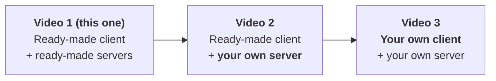
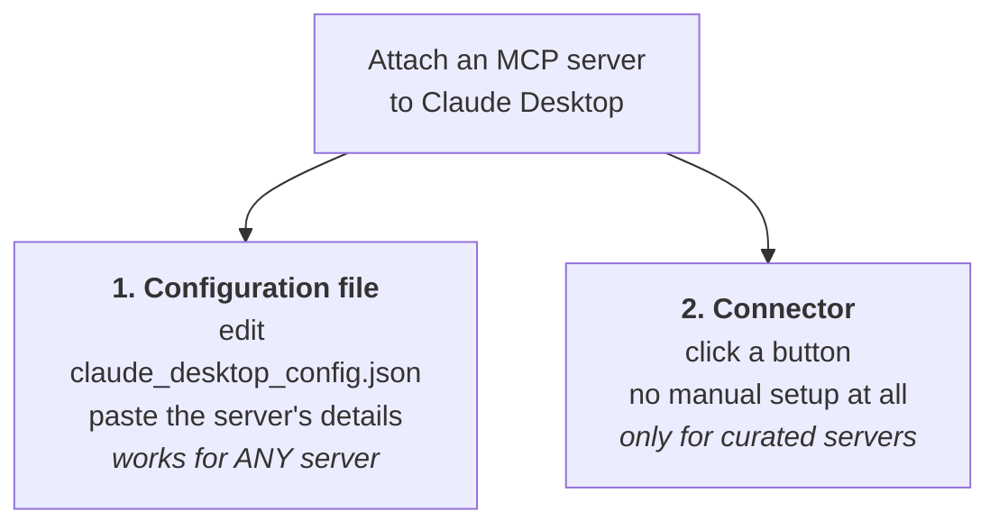
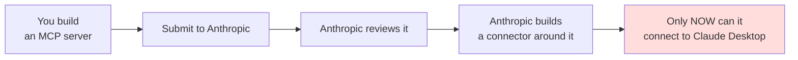
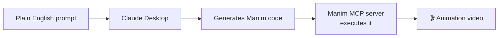

# Using MCP in Practice — Connecting Servers to Claude Desktop

> **One-line summary:** The first hands-on part of MCP: install Claude Desktop as a ready-made host and connect four MCP servers to it — two local, two remote — using both available connection methods (one-click **Connectors** and manual **JSON config file** editing).

---

## Overview

The MCP playlist has three parts:

| Part | Topic | Status |
|---|---|---|
| **Why** | Why MCP is needed | ✅ Covered |
| **What** | Architecture, then Lifecycle | ✅ Covered |
| **How** | Practically implementing MCP | ← **starts here** |

The *How* part is itself three videos:



Today: **nothing is built from scratch**. You experience MCP purely through ready-made tools — Claude Desktop as the client, existing public servers on the other end. Once the understanding is there, the next videos replace each piece with something you wrote yourself.

### Plan of action

1. Install Claude Desktop.
2. Connect it to **four different MCP servers** — two local, two remote.

| # | Server | Type | Connection method | What it does |
|---|---|---|---|---|
| 1 | **Filesystem** | Local | **Connector** | Manipulate directories on your machine |
| 2 | **Manim** | Local | **JSON config** | Generate mathematical animation videos |
| 3 | **Google Drive** | Remote | **Connector** | Read documents from your Drive |
| 4 | **Twitter / X** | *(intended remote — turned out local)* | **JSON config** | Read and post tweets |
| 5 | **Weather** | Remote (genuine) | **JSON config** | Current weather via AccuWeather |

> **Why two of each?** So that every combination of {local, remote} × {connector, JSON config} gets demonstrated at least once.

---

## The Two Ways to Connect a Server



### Method 1 — The JSON configuration file

Every AI host (Claude Desktop, Cursor IDE, …) has a **config file** — a JSON file. You open it and add your MCP server's details there. This is the normal, universal method.

### Method 2 — Connectors

> A **connector** is a built-in feature that links Claude to MCP servers automatically, without the need for manual setup or configuration.

Press one button. No config file editing.

---

## Connectors — Why They Exist

Most Claude users are **non-technical**. They just want Claude Desktop to pull context from the apps they already use — Google Drive, Notion, Slack. But connecting an MCP server the old way needs technical knowledge: open a config file, go to the server's setup page, copy the configuration details, paste them in. That's hard for a non-technical user.

So Anthropic's thinking: for common SaaS tools that nearly everyone uses, **build direct connectors** — click a button instead of walking the configuration path.

The connector system handles all the technicality behind the scenes: **authentication, sign-in flows, API key handling** — all invisible. The end user just presses a button.

### Three benefits

| Benefit | Why |
|---|---|
| **Easier** | One button vs. locating and hand-editing a JSON file |
| **Safer** | Anthropic's own team wrote the code, so they can assure the safety |
| **More consistent** | With the config-file route, servers often failed to load properly. Through a connector, the success rate is high and performance is consistent |

> **Mental model: connectors are like an App Store for MCP servers.** Open Claude Desktop (or ChatGPT), hit the **+** / *Connect tools* option, and you get a listing of servers you can attach directly to your AI host.

### Where to find them in Claude Desktop

```text
Search & Tools icon
  → shows quick options: Drive, Gmail, Calendar…
  → "Add connectors"
      ├── Desktop Extensions  → these become LOCAL MCP servers
      └── Web                 → these become REMOTE MCP servers
```

The catalogue already includes many integrations (Asana, Atlassian, Box, Canva, Gmail, HubSpot, Hugging Face, Indeed, and more) and keeps growing.

---

## Why Not Force Everything Through Connectors?

If connectors are so good, why keep the JSON option at all? **Two reasons.**

### Reason 1 — Connectors are curated and managed

Every connector you see wraps a famous SaaS tool. For each one, Anthropic's team had to:

- write the entire wrapper code
- host it
- maintain it
- handle **OAuth login flows**
- ship **security patches**
- implement **rate limiting**
- ensure the whole experience stays **stable**

That's real effort per server. Now consider: there are **thousands** of MCP servers in the world, with **10–15+ new ones appearing daily**. Forcing every server to have its own connector would mean Anthropic writing a wrapper for every one of them. **Not remotely scalable** — no single company can build connectors for every MCP server on Earth.

### Reason 2 — MCP is an open standard

From day one the promise was: **anyone can build their own client, anyone can build their own server.** Force connectors and you get this:



That **closes the ecosystem**. All control sits with Anthropic — they'd decide whose server runs and whose doesn't. A serious flaw, and it defeats the point of MCP being an open standard.

### The resolution

| Server type | Connection path |
|---|---|
| Standard SaaS products everyone uses | Anthropic builds a **connector** → easy click-to-connect |
| Your company's internal servers, or ones you built personally | **JSON config file** approach |

The upside of the JSON path: **build your server today, connect it to Claude Desktop today.** No gatekeeping.

---

## Setup — Installing Claude Desktop

1. Search for the Claude Desktop download page.
2. Pick the build for your OS (macOS or Windows).
3. Install and sign in.

The interface is essentially the same as any chat interface — nothing new to learn.

> ⚠️ **The rule you'll use constantly:** every time you connect a **new** MCP server, you must **restart Claude Desktop** for it to appear.

---

# Server 1 — Filesystem (Local, via Connector)

The easiest one, because a ready-made connector exists.

### Steps

```text
1. Click the tools icon in Claude Desktop
2. Add connectors → Desktop Extensions → search "Filesystem"
3. Click → Install  (small, instant)
4. Tell it WHICH directories it may access
5. Save → Enable (it's disabled at first) → close
6. Restart Claude Desktop
```

### ⭐ The directory permission step

Installing the filesystem server does **not** give it access to your whole machine. By default you must specify which folder/directory it may touch.

In the demo, only **Desktop** was granted. That means the server can read files on the Desktop and create new ones there — **and nowhere else**.

> This is a **safety feature**. If you granted access to the entire computer and something went wrong behind the scenes, the damage could be significant.

You can add more directories later — Downloads, or the folder of a coding project you're working on.

### Verifying the connection

After restarting, clicking the connector shows **all the tools Claude Desktop now has access to** — effectively the result of calling `tools/list`. You can also **disable individual tools** from here.

### Demo A — Reading

```text
Prompt: "Can you tell me if there are any PDF files on my desktop?"
```

- Claude asks **permission** before using any MCP server tool → *Allow*.
- A warning appears ("I can access your desktop") — dismissed.
- First attempt found no PDFs; on retry it found **five PDF files**.

> **The best part of MCP:** whenever the host wants to use an MCP server tool, it asks you, the user, for permission first.

### Demo B — Writing

```text
Prompt 1: "Write a code to print Fibonacci numbers in Python"
          → Claude writes a few versions in the chat

Prompt 2: "Now write the first version in a .py file and save it on my desktop"
          → permission → Allow → file written
```

Checking the Desktop, the file is there with the code inside.

### Real-world use cases

That demo is deliberately basic. People use the filesystem server far more creatively:

- **Clean up a messy folder** — a Downloads folder you've been dumping into for three or four months. Tell Claude Desktop to organise it properly, and it will.
- **Summarise a code project folder** — point it at a project directory and get an instant summary.

---

# Server 2 — Manim (Local, via JSON Config)

### What is Manim, and why it's exciting

Manim is the Python library behind the 3Blue1Brown YouTube channel — the one famous for explaining mathematics through very strong **visualizations**. Complex maths, made visual.

Coding those animations by hand is **genuinely difficult**. But now:



**Input = an English sentence. Output = a video** — looking much like what you'd see on 3Blue1Brown. Used regularly, it can meaningfully improve how you learn difficult ML/DL concepts.

### Setup steps

The server is community-built (not official) and it's a **local** server — you must clone the repo onto your machine first.

```bash
# 1. Prerequisites
pip install manim
pip install mcp

# 2. Clone the repo where Claude has access
cd Desktop
git clone <manim-mcp-server-repo-url>
```

> Cloned into **Desktop** specifically because that's the directory Claude was granted access to.

### Editing the config file

No connector exists for this server, so use the manual route:

```text
Claude Desktop → Settings → Developer → Edit Config
  → locate claude_desktop_config.json → open in VS Code
  → paste the server block from the repo's README
```

Three paths must be filled in, all found from the terminal:

| What's needed | How to find it (macOS/Linux) |
|---|---|
| Absolute path to **Python** | `which python3` |
| Path to the **manim executable** | `which manim` — on Windows it's `manim.exe`; often you just substitute your username |
| Path to **`manim_server.py`** | `cd Desktop/<repo>/src` then `pwd` |

Rough shape of what goes in the file:

```json
{
  "mcpServers": {
    "manim-server": {
      "command": "/absolute/path/to/python3",
      "args": ["/Users/<you>/Desktop/<repo>/src/manim_server.py"],
      "env": {
        "MANIM_EXECUTABLE": "/absolute/path/to/manim"
      }
    }
  }
}
```

Save → close the file → **quit and restart Claude Desktop** → the Manim server appears.

### Demo — vector transformation animation

The prompt asked the Manim server to create an animation of **vector transformation in linear algebra**: draw a 2D coordinate grid, add the two basis vectors **i** and **j**, apply a given matrix transformation, show the whole grid bending, show the resulting new vectors, and add a title.

Claude wrote exactly the kind of Manim code 3Blue1Brown would have to write by hand — then **executed it and produced the video**.

Result: the two basis vectors appear, the matrix is applied, the entire grid rotates/shears accordingly, and the new vectors **i′** and **j′** are shown.

> ⚠️ **LaTeX gotcha:** without LaTeX installed, mathematical symbols won't render properly — Claude will find a workaround, but symbols may look worse. Installing LaTeX fixes it, but it's a ~10–15 GB install, so weigh that up.

### How to use this yourself

Take a concept you find hard, go to a chatbot, describe the problem, have it **generate a Manim prompt**, then paste that prompt into Claude Desktop. Within a few minutes you have a visualization. Themes, text styles, and many other features are customisable.

---

# Server 3 — Google Drive (Remote, via Connector)

The simplest of all, because Claude Desktop ships with a direct Drive connector.

```text
1. Click the tools icon
2. Select "Drive search"
3. Authenticate via the normal Google sign-in flow
4. Done — the connector shows as enabled
```

### Demo

```text
Prompt: "Can you summarize the document from my Google Drive?"
```

Claude searched, found the document ("AI Newsletter Content Ideas"), and returned a summary. Very easy, very useful — you can pull your Drive context straight into Claude Desktop.

### ⭐ Important limitation

> This is a **read-only** MCP server.

| ✅ Can | ❌ Cannot |
|---|---|
| Read any document on your Drive | Create new files |
| | Edit existing files |

Still very useful — just know the boundary.

---

# Server 4 — Twitter / X (via JSON Config)

### Setup

1. Search for the Twitter MCP server → open the GitHub repo.
2. **Create a developer account** on X. Logging in shows your **Developer Dashboard**.
3. Copy the configuration block from the README into Claude's JSON config file.

### ⚠️ Placement matters

Paste the new block **inside the `mcpServers` dictionary**. Concretely: find where the previous server's closing brace is, add a **comma**, then paste — so you stay inside the outer object.

```json
{
  "mcpServers": {
    "manim-server": { "...": "..." },
    "twitter-mcp": {
      "command": "npx",
      "args": ["-y", "<package-path>"],
      "env": {
        "API_KEY": "<yours>",
        "API_SECRET_KEY": "<yours>",
        "ACCESS_TOKEN": "<yours>",
        "ACCESS_TOKEN_SECRET": "<yours>"
      }
    }
  }
}
```

### Getting the four secrets

```text
Developer Portal → Default Project → Keys and Tokens
  ├── API Key + Secret       → click Regenerate → copy both
  └── Access Token + Secret  → click Generate   → copy both
```

Paste each into the corresponding field, save, quit and restart Claude Desktop.

> If it doesn't work first go, install **npm** (a package manager) and try again.

### 🔍 The correction: this is actually a LOCAL server

Reading the README more carefully revealed the plan had a mistake. Look at the config: `command: npx` with a package path in `args`. Behind the scenes, **npm is installing this MCP server onto your machine**. It *feels* like you installed nothing locally, but that one line does the local install for you.

> **So the Twitter server is a local server, not a remote one** — which is why a genuine remote server (Weather) was added afterwards.

**Lesson:** `npx`/`npm` in the command field is the tell-tale sign of a **local** server, however remote the underlying service feels.

### Demo

After restarting, the Twitter server shows **two tools: `post_tweet` and `search_tweet`.**

```text
Prompt: "What are the top tweets on AI this week?"
  → permission → Allow
  → server creates a search term, searches tweets behind the scenes
  → returns the most recent AI tweets  ✅
```

```text
Prompt: "Post a tweet on my behalf saying: Hello from CampusX"
  → ❌ Authentication error
```

**Cause:** checking the developer portal's *User authentication settings* showed the app had **read permission only**. Posting needs **read *and* write** permission, which requires filling out the full authentication settings form.

> **Takeaway:** read worked, write didn't — and the fix is a **permission scope** on the provider's side, not anything wrong with MCP.

---

# Server 5 — Weather (Genuinely Remote, via JSON Config)

### Setup

```bash
pip install uv
```

Then get an **AccuWeather API key**: search for the AccuWeather API, create an account — the free tier lasts around 15 days, which is sufficient — and grab your key.

Paste the config block into the JSON file (comma first, inside `mcpServers`) and make **two changes**:

1. Insert your **API key**.
2. Replace `uvx` in the `command` field with the **absolute path to uvx** — find it with `which uvx`.

### ⭐ Why this one really *is* remote

Look at what `uv` is being pointed at: **a GitHub path, not a path on your machine.** The server code doesn't exist locally at all — that's what makes it a remote server.

> **Compare the two config files side by side.** Twitter's `args` → an npm package installed locally. Weather's `args` → a remote GitHub path. Same-looking JSON, completely different server type.

### Demo

Restarting Claude Desktop showed the **Weather** tool available.

```text
Prompt: "Can you tell me the current weather of Gurgaon?"
  → the weather tool fires
  → ❌ "I'm having trouble accessing the weather services right now
        due to a technical issue. Let me try searching..."
  → Claude falls back to web search across three or four sources
     and answers anyway
```

The underlying problem was an API-related **"Error calling tool"**. Debugging suggested it was machine-specific rather than a flaw in the approach.

> **Two things worth noticing anyway:** (1) MCP tool failures surface as ordinary errors, and (2) the host can **gracefully fall back** to another capability — here, plain web search — rather than dying.

---

# Comparison Tables

## Connector vs JSON config file

| | **Connector** | **JSON config file** |
|---|---|---|
| Effort | One button click | Locate file, paste block, fill in paths/keys |
| Technical skill | None | Terminal, paths, API keys |
| Auth handling | Automatic (OAuth, sign-in, keys) | You do it manually |
| Available for | Curated famous SaaS tools only | **Any** MCP server |
| Safety | Anthropic-written and maintained | Depends on the server's author |
| Consistency | High success rate | Servers often fail to load properly |
| Your own/company server? | ❌ Not possible | ✅ Works today, no gatekeeping |
| Maintenance burden | On Anthropic | On you |

## The five servers demonstrated

| Server | Local/Remote | Method | Prerequisites | Outcome |
|---|---|---|---|---|
| **Filesystem** | Local | Connector | Grant directory access | ✅ Read PDFs, wrote a `.py` file |
| **Manim** | Local | JSON | `pip install manim mcp`, clone repo, 3 absolute paths | ✅ Generated an animation video |
| **Google Drive** | Remote | Connector | Google sign-in | ✅ Summarised a document (read-only) |
| **Twitter/X** | **Local** (npx) | JSON | Dev account + 4 secret keys | ⚠️ Read ✅ / Write ❌ (permission scope) |
| **Weather** | **Remote** (GitHub path) | JSON | `uv`, AccuWeather key, uvx path | ❌ API error; fell back to web search |

## How to tell local from remote in a config file

| Clue in the config | Server type |
|---|---|
| `command: npx` + npm package | **Local** — npm installs it onto your machine |
| `command: python3` + a path on your disk | **Local** — you cloned it yourself |
| `uv`/`uvx` pointed at a **GitHub path** | **Remote** — code never lands on your machine |
| Connector under **Desktop Extensions** | **Local** |
| Connector under **Web** | **Remote** |

---

# Common Pitfalls / Gotchas

- **Forgetting to restart Claude Desktop.** Every new MCP server requires a restart before it appears. This bites repeatedly.
- **Forgetting to *enable* the connector.** The Filesystem connector installs in a **disabled** state — save, then enable, then close.
- **Expecting filesystem access to be global.** It isn't. You must explicitly grant each directory — deliberately, as a **safety feature**.
- **Pasting a config block in the wrong place.** It must go **inside** the `mcpServers` dictionary, with a **comma** after the previous entry. Land outside the outer braces and nothing loads.
- **Using relative paths or bare command names.** Several servers need **absolute paths** — `which python3`, `which manim`, `which uvx`, `pwd`. Bare `uvx` had to be replaced with its full path.
- **Assuming "remote service" means "remote MCP server."** The Twitter server talks to a cloud API but runs **locally** via npx. Judge by the config, not by the brand.
- **Missing LaTeX for Manim.** Maths symbols render poorly without it; installing it costs ~10–15 GB.
- **Read/write permission scopes.** The Twitter write failure wasn't MCP's fault — the developer app only had **read** scope. Check the provider's auth settings when writes fail but reads work.
- **Assuming Google Drive lets you write.** It's **read-only** — no creating, no editing.
- **Leaving API keys exposed.** Keys shown while configuring should be **deleted/rotated** afterwards. (In the demo, all keys shown on screen were slated for deletion after upload.)
- **Skipping the permission prompt reflexively.** The prompt before every tool use is a feature — it's your last checkpoint before a server touches your files or posts on your behalf.
- **Expecting everything to work first try.** Two of five servers hit issues in a recorded demo. Errors are normal; read the message, check auth scopes and paths.

---

# Key Concepts Worth Remembering

- **Two ways to connect any MCP server: the JSON config file (universal) and Connectors (curated, one-click).**
- **A connector is a built-in feature that links Claude to MCP servers automatically, with no manual setup or configuration.**
- **Connectors = an App Store for MCP servers.** *Desktop Extensions* → local; *Web* → remote.
- **Connectors are easier, safer, and more consistent** — Anthropic writes, hosts, and maintains the code, including OAuth, security patches, and rate limiting.
- **Connectors can't be universal, for two reasons:** they're **curated and managed** (thousands of servers, 10–15+ new daily — not scalable), and forcing them would **close an open standard**, making Anthropic the gatekeeper.
- **The division of labour:** famous SaaS → connector; your own/company servers → JSON config, usable the same day.
- **Restart Claude Desktop after adding any server.** Always.
- **The filesystem server needs explicit per-directory permission** — a deliberate safety boundary.
- **Claude asks permission before every MCP tool use.** That's the best part of MCP.
- **Clicking a connector shows its tool list** — effectively `tools/list` made visible in the UI, and you can disable individual tools.
- **`npx` in a config = local server.** A **GitHub path** in a `uv`/`uvx` config = genuinely remote.
- **Google Drive's MCP server is read-only.**
- **Write failures are usually auth-scope problems**, not MCP problems.
- **Manim + MCP = English prompt in, animation video out** — the 3Blue1Brown workflow, automated.
- **To find new servers: search for "Awesome MCP Servers"** — a maintained, category-divided GitHub list of MCP servers across the internet. Other marketplaces and listing sites exist too.

---

# Where to Find More Servers

> Search for **"Awesome MCP Servers"** on GitHub.

You get a constantly updated list of all kinds of MCP servers on the internet, **divided by category** so you can explore by area of interest. The Manim server in this walkthrough was discovered there, and plenty of similar hidden gems are waiting.

It's effectively a **discovery platform** for MCP servers — and there are other listing websites and marketplaces besides.

### Suggested next step

Go into exploration mode: install Claude Desktop, think of a **workflow you'd like to automate with AI** (the AI-newsletter idea is one example), and try to build it with MCP.

---

# Summary

This is MCP's *How*, stage one: you connect a **ready-made client** (Claude Desktop) to **ready-made servers**, building nothing yourself, purely to feel the client–server communication working. Two connection methods exist — the universal **JSON config file** and one-click **Connectors** — and both were exercised against both local and remote servers so all four combinations were covered.

**Connectors** are the easy, safe, consistent path because Anthropic writes and maintains the wrapper code, handling authentication invisibly; but they can never cover everything, since curating thousands of servers isn't scalable and mandating them would close what is meant to be an **open standard**. Hence the split: famous SaaS tools get connectors, while your own servers go through the config file and work the same day you build them.

Along the way came the practical lessons that actually matter: always restart after adding a server, grant filesystem access one directory at a time, put your config block inside `mcpServers`, use absolute paths everywhere, and read the config rather than the brand to tell **local** (`npx`, local clone) from **remote** (a GitHub path). Two of five servers hit errors — a write-permission scope on X and an API failure on Weather — which is a realistic picture of the experience, not a sign anything is wrong with the approach.

Next up: the same client, but talking to **an MCP server you built yourself**.
