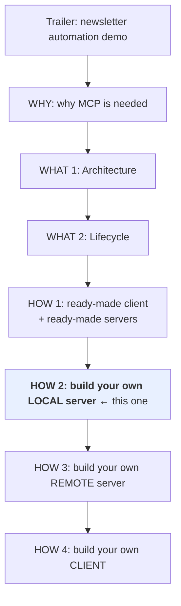
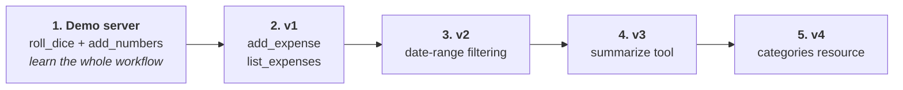
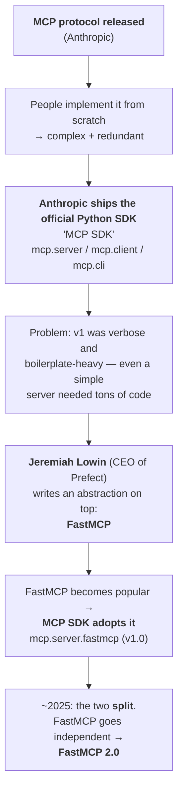
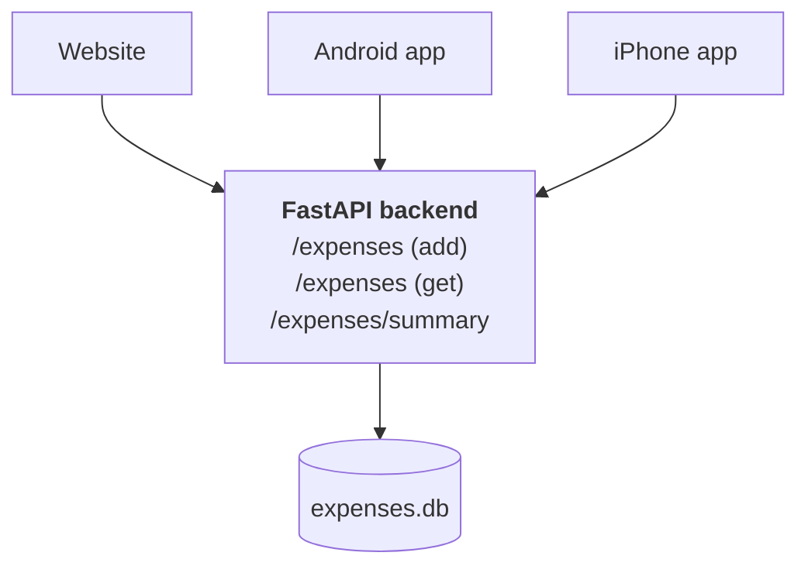

# Building Your Own Local MCP Server (FastMCP)

> **One-line summary:** Build an MCP server from scratch in Python using FastMCP — starting with a trivial demo server to learn the workflow, then incrementally growing it into a working natural-language **Expense Tracker** wired into Claude Desktop over STDIO.

---

## Overview

### Where this sits in the journey



Last time you used a ready-made client (Claude Desktop) and ready-made servers (Google Drive, filesystem, etc.). Now you write the server yourself.

### Today's scope

- Build a **local** server only — it runs on your own machine and Claude Desktop talks to it over **STDIO**.
- Next video: improve it, make it production-ready, and convert it into a **remote** server hosted somewhere, so anyone in the world can use it from their own client.

### What we're building — and why this one

Most MCP tutorials go to one of two extremes: a trivially simple calculator server, or something quite advanced. This takes the middle path — **intermediate difficulty, but genuinely useful**.

**An Expense Tracker MCP server.** You talk to your chatbot in plain English and it manages your expenses:

```text
"Add 500 travel expense for cab ride yesterday"
"Show me all expenses from September in tabular fashion"
"How much did I spend on health in August?"
"What was my total expense on education in last 10 days?"
```

The motivation: expense tracking today happens through **apps** — open the app, fill in a form. Cumbersome. And you can't ask natural questions; you interpret graphs instead. Here the whole process becomes natural language, because we have the power of an LLM behind it.

---

## Plan of Action



Build the demo server first, purely to nail down the process: installation → running → testing → integrating with Claude Desktop. Once that flow is clear, replace its code and grow the expense tracker **incrementally**, three or four iterations to a properly functioning tool.

---

# The Library Confusion — MCP SDK vs FastMCP

Before any code, a clarification that saves real confusion.

## Why you need a library at all

MCP is a **protocol** = a set of rules. You *could* implement those rules yourself in Python to build your own server or client. Two problems:

1. **Very complex for a beginner** — bringing all those rules together and building a server on top of them is difficult.
2. **Redundant** — building two servers means repeating the same set of rules twice. Not a sign of a good programmer.

So: use a ready-made library and skip the boilerplate.

## But there are *two* libraries…

Search "how to build MCP servers" and you'll see two names — **MCP SDK** and **FastMCP** — and, confusingly, **the code inside both looks basically the same.** Here's the chronology that explains it.



### Stage 1 — the official MCP SDK

Three sub-libraries:

| Sub-library | Purpose |
|---|---|
| `mcp.server` | Build your own servers |
| `mcp.client` | Build your own clients |
| `mcp.cli` | Run MCP commands from the command line — run your server, debug it |

```bash
pip install "mcp[cli]"     # installs all three
```

### Stage 2 — the boilerplate problem

The first SDK version was **verbose and boilerplate-heavy**. Even a server that just adds two numbers required a large amount of code — mostly boilerplate, plus handling the transport yourself. Frankly intimidating to look at, and **not beginner-friendly**. Many people simply couldn't get servers built.

### Stage 3 — FastMCP appears

Jeremiah Lowin, CEO of **Prefect** (an MLOps/orchestration tool, a more beginner-friendly take on something like Airflow), spotted the problem and wrote an **abstraction on top of the MCP SDK** called **FastMCP**. Same two-number-adder, drastically less code. People realised it was a much better approach.

### Stage 4 — absorption, then divorce

FastMCP got so popular that the MCP SDK **adopted it**: `FastMCP` became available by default inside `mcp.server.fastmcp`, importable in a single line. But the two projects had different ambitions — FastMCP's creator wanted to scale it with many more features, while the MCP SDK wanted to stay focused purely on the MCP spec. Around 2025 they **broke apart**, and FastMCP became an independent library, now at **FastMCP 2.0**.

> The analogy: **TensorFlow and Keras.** TensorFlow came first and was difficult. Keras arrived as a simple layer on top. Keras became so popular that in TensorFlow 2 it effectively *became* the main way you write code.

### Where things stand now

| Option | Command | What you get |
|---|---|---|
| **A** | `pip install "mcp[cli]"` | MCP SDK, with **FastMCP v1.0** inside it |
| **B** | `pip install fastmcp` | **FastMCP 2.0** only, standalone |

> **Either way, the code you write is FastMCP code.** That's why tutorials using different libraries show identical-looking code. Only the library differs.

### Which to pick, and why

This walkthrough uses **FastMCP**, on the reasoning that FastMCP will likely become the standard: the MCP SDK is a **low-level specification**, FastMCP is a **developer-friendly abstraction** — and in software, developer-friendly things generally win the race.

### Historical precedent: WSGI → Flask

This exact pattern has played out before. **WSGI** (Web Server Gateway Interface) is a protocol/specification, just like MCP, letting Python apps talk to web servers. Coding backends directly against WSGI was difficult. **Flask** arrived, built on top of WSGI, and simplified everything. Over time people forgot about WSGI and everyone uses Flask.

| | Low-level spec | Friendly abstraction |
|---|---|---|
| Web | **WSGI** | **Flask** |
| Deep learning | **TensorFlow** | **Keras** |
| MCP | **MCP SDK** | **FastMCP** |

> 🔔 And the name *FastMCP* should ring a bell — there's a real connection to **FastAPI**, covered at the end of these notes.

---

# Part 1 — The Demo Server

**Goal:** not a good server — a full understanding of the *process*. Two tools: roll a die (1–6), and add two numbers.

## Step 1 — Install `uv`

`uv` is a new package manager, much faster than pip, and **FastMCP recommends using it**.

```bash
pip install uv
```

## Step 2 — Create a project folder

Create a new folder on the Desktop. Name it `expense-tracker-mcp-server` right away — the demo code gets replaced with expense-tracker code later anyway.

## Step 3 — Open it in VS Code

`File → Open Folder → <your folder>`

## Step 4 — Initialise `uv`

```bash
uv init .        # "." = current directory
```

This generates some files, including **`main.py`** — where the code goes.

## Step 5 — Install FastMCP

```bash
uv add fastmcp        # pip equivalent: pip install fastmcp
```

Verify:

```bash
fastmcp --version
```

Which reports the FastMCP version (2.11 in the demo), the MCP version, the Python version, the platform, and the install root path. If all of that shows up correctly, FastMCP is installed properly in your project.

## Step 6 — Write the server

```python
from fastmcp import FastMCP
import random

mcp = FastMCP("Demo Server")

@mcp.tool
def roll_dice(n_dice: int = 1) -> list[int]:
    """Roll `n_dice` 6-sided dice and return the results."""
    return [random.randint(1, 6) for _ in range(n_dice)]

@mcp.tool
def add_numbers(a: int, b: int) -> int:
    """Add two numbers together."""
    return a + b

if __name__ == "__main__":
    mcp.run()
```

### The anatomy — it's genuinely this simple

| Line | What it does |
|---|---|
| `from fastmcp import FastMCP` | Import the class |
| `mcp = FastMCP("Demo Server")` | Create a **server instance**; you can pass multiple options — here just a name |
| Plain Python function | An ordinary function that does the work |
| **`@mcp.tool`** | ⭐ The decorator that **turns a Python function into an MCP tool** |
| `mcp.run()` | Runs the server |

> **The core idea:** write a normal Python function for each capability, then slap `@<your_server_name>.tool` on top. That's it. That's how you build MCP servers with FastMCP.

## Step 7 — Test with MCP Inspector

**MCP Inspector** is a well-known debugging tool from Anthropic, which ships with FastMCP.

```bash
uv run fastmcp dev main.py
```

A server starts behind the scenes and the Inspector opens in the browser.

> **Think of it as Postman, but for MCP servers.** Test the server *before* wiring it into Claude — debugging inside Claude is much worse than debugging here.

What to do in the Inspector:

```text
1. Check Transport Type → STDIO  (server and client on the same machine)
2. Change nothing else → click Connect
   → connected means your server works
3. Tabs: Resources | Prompts | Tools   ← the three primitives
   (this server has only Tools)
4. Tools → "List Tools"
   → behind the scenes a JSON-RPC `tools/list` message is sent
   → History panel shows every JSON-RPC message exchanged so far,
     including the initialize handshake and capability exchange
5. Click a tool → enter arguments → "Run Tool"
   → result appears, and History shows the tools/call exchange
```

The Inspector also exposes ping, sampling, elicitation, authorization — everything discussed in the architecture and lifecycle notes, visible in one place.

## Step 8 — Run the server

```bash
uv run fastmcp run main.py
```

The server starts and prints its details: server name, which transport is in use, FastMCP and MCP SDK versions, where to find docs, and where you can deploy. Your server is now live on your machine, and any client on that machine can connect to it.

## Step 9 — Install it into Claude Desktop

Since we don't have a custom client yet, install directly into Claude Desktop with one command:

```bash
uv run fastmcp install claude-desktop main.py
```

Optional extras: give the server a custom name, add environment variables.

Output: *Successfully installed Demo Server in Claude Desktop.*

### ⚠️ The `uv` path gotcha (you WILL hit this)

Opening Claude, it fails to connect to the demo server. Diagnosis:

```text
Settings → Developers → the server isn't added properly
Settings → Developer → Edit Config → open the JSON
```

The server block *was* added, but the `command` field just says `uv` — a bare command name. Fix:

```bash
which uv     # copy the absolute path
```

Replace `"command": "uv"` with the absolute path, save, close, **fully quit Claude Desktop and restart it**.

```diff
- "command": "uv",
+ "command": "/Users/<you>/.local/bin/uv",
```

Now the demo server appears with its two tools.

## Step 10 — Try it

```text
"Roll a die"        → Allow once → 2
"Roll two dice"     → Allow       → 4 and 3
"Add 234 and 567"   → Allow once  → works
```

✅ First MCP server built and integrated. Now replace it with something useful.

---

# Part 2 — The Expense Tracker

## Feature roadmap

| # | Feature | Status |
|---|---|---|
| 1 | **add_expense** | ✅ built here |
| 2 | **list_expenses** (with date range) | ✅ built here |
| 3 | **summarize** (by category + date range) | ✅ built here |
| — | *edit_expense* | 🔨 exercise for you |
| — | *delete_expense* | 🔨 exercise |
| — | *add_credit* (salary, money received) | 🔨 exercise |
| — | *budgets* | 🔨 exercise |

> Only three features are implemented because the goal is **learning, not shipping a product**. Adding the rest is strongly recommended after watching — you can turn this into a proper expense tracker.

## Database choice

In a real production setup you'd use Oracle, MySQL, or Postgres. Since the focus is the MCP server, we use **SQLite** — easiest to set up, and the database file lives right inside the project folder so you can inspect transactions immediately.

> If you want to do this project properly, **replace SQLite with a real database.**

## The schema

```python
import sqlite3
from pathlib import Path
from fastmcp import FastMCP

mcp = FastMCP("Expense Tracker")

DB_PATH = Path(__file__).parent / "expenses.db"

def init_db():
    with sqlite3.connect(DB_PATH) as c:
        c.execute("""
            CREATE TABLE IF NOT EXISTS expenses (
                id           INTEGER PRIMARY KEY AUTOINCREMENT,
                date         TEXT NOT NULL,
                amount       REAL NOT NULL,
                category     TEXT NOT NULL,
                subcategory  TEXT DEFAULT '',
                note         TEXT DEFAULT ''
            )
        """)

init_db()
```

| Column | Meaning |
|---|---|
| `id` | Unique for every transaction |
| `date` | When the transaction happened |
| `amount` | How much |
| `category` | e.g. Travel |
| `subcategory` | e.g. Cab ride |
| `note` | Side note, e.g. "cab ride to airport" |

> The function checks whether the table exists; if not, it creates it with this schema.

---

## Iteration 1 — `add_expense` + `list_expenses`

```python
@mcp.tool
def add_expense(date: str, amount: float, category: str,
                subcategory: str = "", note: str = ""):
    """Add a new expense entry to the database."""
    with sqlite3.connect(DB_PATH) as c:
        cur = c.execute(
            """INSERT INTO expenses(date, amount, category, subcategory, note)
               VALUES (?, ?, ?, ?, ?)""",
            (date, amount, category, subcategory, note)
        )
        return {"status": "ok", "id": cur.lastrowid}


@mcp.tool
def list_expenses():
    """List all expense entries from the database."""
    with sqlite3.connect(DB_PATH) as c:
        cur = c.execute(
            """SELECT id, date, amount, category, subcategory, note
               FROM expenses ORDER BY id ASC"""
        )
        cols = [d[0] for d in cur.description]
        return [dict(zip(cols, row)) for row in cur.fetchall()]
```

The database code is deliberately plain: connect with `sqlite3`, get a cursor, call `execute` with a SQL query. If you've ever taken a databases class this is very straightforward. (If not — paste the code into a chatbot and ask for a line-by-line explanation.)

### ⭐ Always add a description

> **An MCP tool should always have a description.**

In FastMCP the **docstring becomes the tool's description**, which is what the LLM reads to decide whether and how to use it. `"""Add a new expense entry to the database."""` isn't decoration — it's how the model knows this tool exists for this purpose.

### Deploying the change

```bash
# 1. paste the new code into main.py, save
# 2. restart Claude Desktop
```

If the server doesn't appear:

```bash
uv run fastmcp install claude-desktop main.py
# then fix the bare `uv` → absolute path in the config again
# then fully restart Claude
```

> **The `uv`-path fix is needed every time you reinstall.** Budget for it.

### Testing

```text
"Add an expense: cab ride to Delhi last Sunday, fare was ₹800"
   → Always allow (this server is harmless)  → added

"Add expense groceries yesterday for 500"
   → no permission prompt this time (already always-allowed) → added
```

Opening `expenses.db` in the project folder shows two transactions. Claude figured out dates itself ("yesterday" → the 26th, since today is the 27th) and populated notes correctly.

> ⚠️ **First flaw spotted:** the `subcategory` column is **empty** — Claude ignored it entirely. Held for later.

---

## Iteration 2 — Date-range filtering

**Problem:** `list_expenses` returns *everything*, which isn't very useful. Normally you want expenses within a date range — last month, last week, yesterday.

**Change:** add two parameters and a `WHERE` clause. Nothing else changes.

```python
@mcp.tool
def list_expenses(start_date: str, end_date: str):
    """List expense entries within an inclusive date range."""
    with sqlite3.connect(DB_PATH) as c:
        cur = c.execute(
            """SELECT id, date, amount, category, subcategory, note
               FROM expenses
               WHERE date BETWEEN ? AND ?
               ORDER BY id ASC""",
            (start_date, end_date)
        )
        cols = [d[0] for d in cur.description]
        return [dict(zip(cols, row)) for row in cur.fetchall()]
```

Replace the old function in `main.py`, save, restart Claude.

### Testing

```text
"Show me all the expenses from September first week"
   → Claude derives start_date = Sept 1, end_date = Sept 7 automatically ✅

"List my expenses from the last week in tabular manner"
   → derives last week's dates → 4 transactions, ₹3,500 total ✅
```

> **Notice what the LLM is doing for free:** natural date expressions ("September first week", "last week", "yesterday") become concrete `start_date`/`end_date` arguments without you writing a single line of date-parsing code.

---

## Iteration 3 — The `summarize` tool

**Goal:** answer questions like *"How much did I spend on transport last week?"*, *"…on groceries last week?"*, *"…on entertainment last month?"* — i.e. **a summary total within a date range, for a particular category.**

```python
@mcp.tool
def summarize(start_date: str, end_date: str, category: str = None):
    """Summarize expenses by category within an inclusive date range."""
    with sqlite3.connect(DB_PATH) as c:
        query = """
            SELECT category, SUM(amount) AS total_amount
            FROM expenses
            WHERE date BETWEEN ? AND ?
        """
        params = [start_date, end_date]

        if category:
            query += " AND category = ?"
            params.append(category)

        query += " GROUP BY category ORDER BY category ASC"

        cur = c.execute(query, params)
        cols = [d[0] for d in cur.description]
        return [dict(zip(cols, row)) for row in cur.fetchall()]
```

Three arguments; **`category` is optional**:

| `category` given? | Result |
|---|---|
| ✅ Yes | Total spent in that category within the date range |
| ❌ No | Total spent within the date range **across all categories** |

> The code only looks long because the query is **broken up** to handle the optional-category condition. A base query, an appended `AND category = ?` if needed, then `GROUP BY` / `ORDER BY`. The rest is identical to the other tools.

### Testing

```text
"What was my total expense on education last week?"
   → ⚠️ Claude answered from data already in its context — it didn't call the tool
```

> **Interesting failure mode:** the LLM had recent results in context and answered from them rather than querying. Rephrasing forced a real call:

```text
"Total expense on education in last 10 days"
   → summarize(start_date=18th, end_date=27th, category="Education")
   → ₹1,800 — online course subscription ✅
```

---

## Iteration 4 — Categories as a **Resource** ⭐

This is a small change but an important one.

### The problem

When adding an expense, **Claude invents the category itself.**

```text
"Add a new expense: Udemy course purchase on last Friday, ₹999"
   → amount: supplied by us
   → category: invented by Claude
```

Which means: today it writes `Education`. Tomorrow it might write `Upskilling`, or `education` in lowercase. The result is **irregular entries in the database** that cause problems at analysis time. What we need is a **consistent schema with consistent entries** so analysis stays easy later.

> This also explains something seen earlier in the demo — a feedback note about *"transport"* and *"transportation"* existing as two separate categories. Same root cause.

Plus the `subcategory` column that Claude has been ignoring completely.

### The fix — add a Resource

Add a **resource** to the server: a JSON file listing every allowed category and, inside each, its allowed subcategories.

```json
{
  "categories": [
    {
      "name": "Transport",
      "subcategories": ["Cab ride", "Fuel", "Public transit", "Flights"]
    },
    {
      "name": "Food",
      "subcategories": ["Groceries", "Restaurants", "Delivery"]
    },
    {
      "name": "Education",
      "subcategories": ["Online course", "Books", "Tuition"]
    }
  ]
}
```

```python
CATEGORIES_PATH = Path(__file__).parent / "categories.json"

@mcp.resource("expense://categories", mime_type="application/json")
def categories():
    """Allowed expense categories and their subcategories."""
    return CATEGORIES_PATH.read_text()
```

The resource function's whole job: **open the JSON file, read it, return the contents.**

Paste it into `main.py` below the tools, put the path constant at the top of the file, save, restart Claude.

### Using it


```text
"Add a new transaction: cab ride to airport last Wednesday, 700.
 Pick category from the pasted text."

   → category: Transport   ← from OUR list, not invented
   → subcategory: also now picked  ← previously always empty
```

✅ Consistent category **and** subcategory information in the database every time. A much better approach.

> **The broader lesson:** resources aren't just for documents. Here a resource acts as a **controlled vocabulary** that constrains the model's output — turning a free-text field into a validated enum without writing validation code.

---

# Part 3 — The FastAPI Connection

The promised side note: **FastMCP and FastAPI are related.**

## How they're related

1. FastMCP's creators **studied FastAPI closely**, and the same principles used in FastAPI were used inside FastMCP. The two libraries share a **design philosophy**.
2. More practically: **FastMCP is built to be compatible with FastAPI.** You can convert a FastAPI app into a FastMCP server — and the reverse is also true.

## Why you'd want that — the business scenario

Consider a company, CampusX, with one product: an **Expense Tracker**.



Three frontends — website, Android, iPhone — all powered by the **same FastAPI endpoints**. That's the existing architecture, and it works.

The demo project mirrors exactly what was built in this video, but as a FastAPI app: same `expenses.db`, a database initialiser, a **Pydantic class** validating each expense, and three endpoints matching the three features. Running the FastAPI docs page and executing the add-expense endpoint (date, amount ₹1000, category Entertainment, note "Netflix subscription") writes straight into the same database.

**Then MCP arrives.** As a business owner: *the more platforms my application runs on, the better.* So now I need an MCP server too — and building it means **redoing all the work I already did in FastAPI**, rewriting the whole thing with a library like FastMCP.

## The one-liner that saves that work

```python
from fastmcp import FastMCP
from main import app          # your existing FastAPI app

mcp = FastMCP.from_fastapi(app=app, name="Expense Tracker MCP")

if __name__ == "__main__":
    mcp.run()
```

That's the entire file. No other code. FastMCP is intelligent enough to understand it must convert the FastAPI application into an MCP server. You can still add extra tools if you want to — but you don't have to.

### Verifying

```bash
uv run fastmcp dev server.py
```

Inspector → Connect → no resources, no prompts → **Tools → List Tools → three tools**, matching the three endpoints. Running `add_expense` from the Inspector (date, ₹2000, category Shopping, note "purchased cricket bat") shows **success**, and the row appears in the database.

```bash
uv run fastmcp install claude-desktop server.py
# ⚠️ make sure you remove the previous server first
```

> **The main benefit of using FastMCP:** as a company, your development time is drastically reduced. You don't rebuild the server — you wrap what you already shipped.

This is a new feature, but likely to be heavily used going forward.

---

# Comparison Tables

## MCP SDK vs FastMCP

| | **MCP SDK** | **FastMCP** |
|---|---|---|
| Who made it | Anthropic (official) | Jeremiah Lowin (CEO of Prefect) |
| Nature | Low-level **specification** | Developer-friendly **abstraction** |
| Install | `pip install "mcp[cli]"` | `pip install fastmcp` |
| Version relationship | Contains **FastMCP v1.0** inside | Independent, now **v2.0** |
| Boilerplate | Heavy (in early versions) | Minimal |
| Beginner-friendly | ❌ | ✅ |
| Code you actually write | FastMCP code | FastMCP code |
| Analogy | WSGI / TensorFlow | Flask / Keras |

## Tool vs Resource, as used here

| | **Tool** (`@mcp.tool`) | **Resource** (`@mcp.resource`) |
|---|---|---|
| Decorator | `@mcp.tool` | `@mcp.resource(...)` |
| Purpose | Perform an action | Supply readable data |
| Example here | `add_expense`, `list_expenses`, `summarize` | `categories` (the JSON file) |
| Nature of data | Dynamic | Static |
| Invoked by | The model choosing to call it | Being attached to the conversation |
| Problem it solved here | The actual functionality | **Inconsistent category naming** |

## The three testing/running commands

| Command | What it does | When to use |
|---|---|---|
| `uv run fastmcp dev main.py` | Launches **MCP Inspector** | Debugging — *always test here first* |
| `uv run fastmcp run main.py` | Runs the server on your machine | Checking it starts; serving local clients |
| `uv run fastmcp install claude-desktop main.py` | Registers it in Claude's config | Wiring into Claude Desktop |

## Build-from-scratch vs library

| | **From scratch** | **With a library** |
|---|---|---|
| Complexity | Very high for a beginner | Low |
| Two servers? | Repeat the same rules twice — redundant | Reuse |
| Transport handling | Yours | Handled |
| Verdict | Don't | Do |

---

# Common Pitfalls / Gotchas

- **The bare `uv` in the config.** `fastmcp install` writes `"command": "uv"`, which Claude can't resolve. Replace it with the output of `which uv` — **every time you reinstall.**
- **Forgetting to restart Claude Desktop** after *any* change to the server file. Nothing updates until you do.
- **Omitting the docstring/description.** An MCP tool should always have a description — it's what the LLM reads to decide when to use the tool.
- **Letting the LLM invent enum-like fields.** Categories drifted (`Education` vs `Upskilling` vs `education`; `transport` vs `transportation`) and produced irregular database entries that break analysis later. Fix: expose the allowed values as a **resource**.
- **Assuming the model will fill every parameter.** `subcategory` was silently ignored until the resource forced it.
- **Assuming a tool will always be called.** Asked about education spending, Claude answered from **context it already had** instead of querying. Rephrasing forced a real tool call — worth knowing when your results look suspiciously instant.
- **Debugging inside Claude first.** Much worse than the Inspector. Build → test in **MCP Inspector** → *then* integrate.
- **Using SQLite in production.** Fine for learning, wrong for a real product — swap in Postgres/MySQL/Oracle.
- **Confusing the two libraries.** They aren't rivals in the code you write — both end up as FastMCP code. Pick one and move on.
- **Leaving a stale server registered.** When installing the FastAPI-converted `server.py`, remove the previous registration first, or you'll have duplicates.

---

# Key Concepts Worth Remembering

- **MCP is a protocol = a set of rules.** Implementing it from scratch is complex and redundant — use a library.
- **MCP SDK = low-level spec. FastMCP = developer-friendly abstraction.** The code you write is FastMCP either way.
- **The lineage:** protocol → official SDK (too verbose) → FastMCP written on top → SDK absorbs it (v1.0) → FastMCP splits off as independent **v2.0**.
- **The recurring pattern: WSGI→Flask, TensorFlow→Keras, MCP SDK→FastMCP.** Developer-friendly abstractions win the race.
- **`uv` is the recommended package manager** — faster than pip, and what FastMCP suggests.
- **Server setup in five commands:** `pip install uv` → `uv init .` → `uv add fastmcp` → write `main.py` → `uv run fastmcp install claude-desktop main.py`.
- **Three lines make a server:** import `FastMCP`, instantiate it, call `mcp.run()`.
- **`@mcp.tool` turns any Python function into an MCP tool.** `@mcp.resource` does the same for data.
- **Always write a docstring** — it becomes the tool description the model reads.
- **MCP Inspector = Postman for MCP servers.** Test there before touching Claude. It shows the raw JSON-RPC history, including the initialize handshake.
- **Local server ⇒ STDIO transport**, because client and server sit on the same machine.
- **Replace `uv` with its absolute path** in Claude's config, every time.
- **Resources can constrain model output**, not just supply documents — the categories JSON turned a free-text field into a controlled vocabulary.
- **`FastMCP.from_fastapi(app=app)` converts an existing FastAPI app into an MCP server in one line** — and the reverse works too. Massive development-time saving for companies that already shipped an API.

---

# Summary

MCP is a protocol, and implementing its rules by hand is both complex and redundant — so you reach for a library, which is where the **MCP SDK vs FastMCP** confusion comes from. The resolution is simple: the SDK is the low-level spec, FastMCP is the friendly abstraction built on top, they merged and later split, and **whichever you install, the code you write is FastMCP code** — the same WSGI→Flask, TensorFlow→Keras story replaying.

Building a server turns out to be remarkably little work: `uv init`, `uv add fastmcp`, instantiate `FastMCP(...)`, write ordinary Python functions, and decorate them with **`@mcp.tool`**. Test in **MCP Inspector** (Postman for MCP servers) before wiring anything into Claude, then `fastmcp install claude-desktop` — remembering to swap the bare `uv` for its absolute path and restart Claude every single time.

The Expense Tracker grew across four iterations: two basic tools over SQLite, then date-range filtering, then a `summarize` tool with an optional category, and finally a **resource** exposing the allowed categories as JSON. That last step is the subtle one — it fixed inconsistent, model-invented category names and populated the ignored `subcategory` field, showing that resources can act as a **controlled vocabulary** rather than just a document store.

Closing on the FastAPI connection: FastMCP borrows FastAPI's design philosophy and is deliberately compatible with it, so `FastMCP.from_fastapi(app=app)` converts an entire existing API into an MCP server in one line — no rebuild required. Next: taking this local server and turning it into a hosted **remote** server anyone in the world can use.
