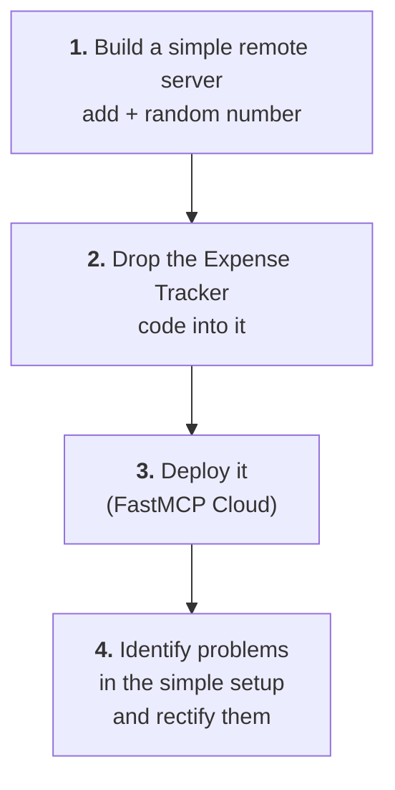
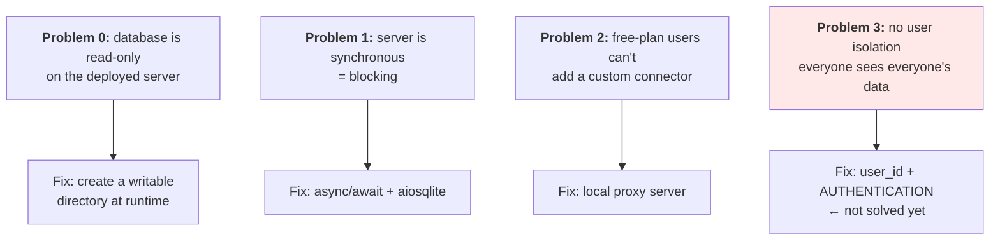
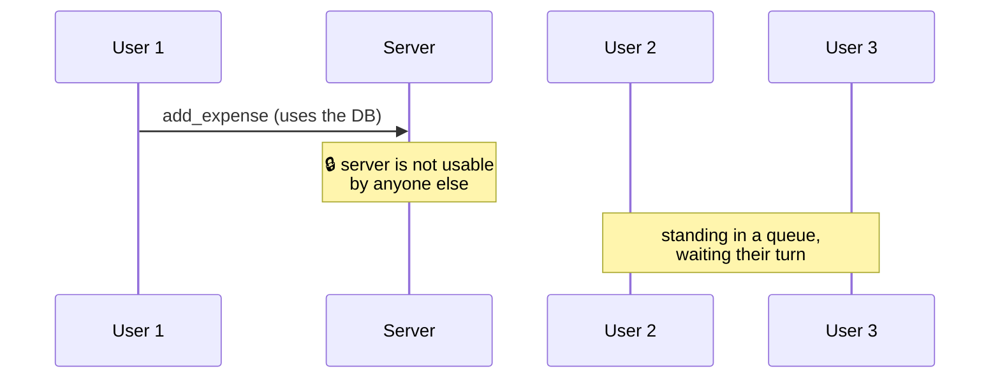
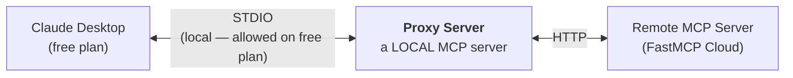
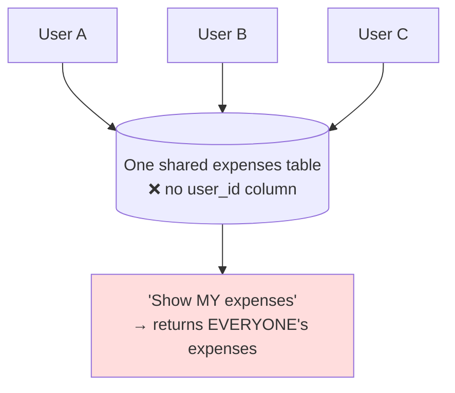

# Building & Deploying a Remote MCP Server (FastMCP Cloud)

> **One-line summary:** Take the same FastMCP library used for local servers, change essentially one line to switch the transport to HTTP, deploy the Expense Tracker to FastMCP Cloud, and then fix the three real problems that only surface once a server is public — read-only storage, blocking I/O, and no per-user isolation.

---

## Overview

Last time: **local** MCP servers with FastMCP. Now: **remote** ones — built, deployed, and shareable with anyone in the world.

### Local vs Remote — recap

| | **Local server** | **Remote server** |
|---|---|---|
| Where it runs | The **same machine** as the host + client | A **different machine on the internet** |
| Serving many clients at once | ❌ | ✅ |
| Compute available | Your laptop | Powerful server machines — good for **compute-intensive tasks** |
| Speed | **Faster** — all communication on one machine | **Relatively slower** — communication over internet/network |
| Transport | STDIO | HTTP |

> **Rule of thumb:** the **enterprise** MCP servers you'll encounter in future — the ones from big companies — will **mostly be remote.** That's what makes this topic important.

### ⭐ The good news about the code

> From a **code point of view, a local and a remote MCP server look almost the same.**

So there's nothing genuinely new to learn about writing them. Still, *some* changes are required — and, more interestingly, deploying to the public surfaces flaws that were invisible when only you were using it.

---

## Plan of Action



**Deployment options** include AWS and platforms like Render — but here we use **FastMCP Cloud**, a service from the FastMCP team itself, currently **free**, and very easy to deploy remote servers with.

---

# Part 1 — A Simple Remote Server

## Setup (identical to the local flow)

```bash
pip install uv                     # 1. install uv
# 2. create a new folder, e.g. "test-remote-server"
# 3. open it in VS Code
uv init .                          # 4. initialise uv in the folder
uv add fastmcp                     # 5. add FastMCP
```

## The code

```python
from fastmcp import FastMCP
import random

mcp = FastMCP("Simple Calculator Server")

@mcp.tool
def add(a: float, b: float) -> float:
    """Add two given numbers."""
    return a + b

@mcp.tool
def random_number(minimum: int, maximum: int) -> int:
    """Generate a random number within a given range."""
    return random.randint(minimum, maximum)

@mcp.resource("info://server")
def server_info():
    """Information about this server."""
    return {"name": "Simple Calculator Server", "version": "1.0"}

if __name__ == "__main__":
    mcp.run(
        transport="http",
        host="0.0.0.0",
        port=8000,
    )
```

Two tools (add two numbers, generate a random number in a range) and one resource giving information about the server. Nothing exotic.

## ⭐ The one change that matters

```diff
- mcp.run()                                    # local server
+ mcp.run(transport="http", host="0.0.0.0", port=8000)   # remote server
```

| | Meaning |
|---|---|
| `mcp.run()` alone | In FastMCP this means **transport = STDIO** |
| `transport="http"` | We want **Streamable HTTP** as the transport |
| `host="0.0.0.0"` | Ready to accept requests **from any IP address** |
| `port=8000` | The port to serve on |

> **This is the only change — and the most important change — you have to make in order to build a remote MCP server.** Everything else in the file is written exactly the way you'd write a local server.

## Running it

```bash
# The full form:
fastmcp run main.py --transport http --host 0.0.0.0 --port 8000

# If that's too long to remember, since the settings are already in the code:
uv run main.py
```

The server starts and prints: server name (*Simple Calculator Server*), transport (*Streamable HTTP*), and the **server URL**.

## Testing in MCP Inspector

```bash
uv run fastmcp dev main.py
```

```text
Transport → select "Streamable HTTP"  ← different from the local case
Connect
  Resources → List Resources → server_info ✅
  Prompts   → none
  Tools     → List Tools → add, random_number
              random_number(min=10, max=100) → Run Tool → 22 ✅
```

---

# Part 2 — Deploying to FastMCP Cloud

## Step 1 — Push the code to GitHub

FastMCP Cloud deploys from a **Git repository**, so the code has to go up first.

```bash
git init                    # often already done by uv init
git status                  # see what's new
git add .
git commit -m "Initial commit"
git remote add origin <your-repo-url>
git push origin main
```

## Step 2 — Deploy

Go to **fastmcp.cloud** and create an account. Two options are offered:

| Option | Use |
|---|---|
| Use one of their **templates** | Quick start |
| **Deploy from your own code** | ← what we want |

Choosing your own code prompts you to **connect your GitHub account** (simple prompts, just accept). Your recent repositories then appear; pick the one you pushed.

### Deployment settings

| Setting | What it is |
|---|---|
| **Name** | Randomly generated by default; **forms part of your remote server's URL**, so you can put your own or your company's name here |
| **Entry point** | Which file holds your code → `main.py` |
| **Authentication** | None, in this walkthrough |
| **Discoverable** | If enabled, your server gets listed on FastMCP's **curated page**. Not needed here. |

Click **Deploy** → the build runs → and just like that, the remote MCP server is live.

## Step 3 — Use it from Claude Desktop

Copy the URL. **You can share this URL with any friend or colleague** — all they need is Claude Desktop.

```text
Claude → Settings → Connectors → (scroll to bottom) → Add custom connector
  → Name:  "Nitish Test MCP Server"
  → URL:   <your remote server URL>
  → Add → confirm
  → fully restart Claude Desktop
```

The server appears with its two tools.

```text
"Generate random number between 11 and 20"  → Allow → ✅ works
```

### ⚠️ Pro-plan disclaimer

> **"Add custom connector" is not available on Claude's free plan** — it's a Pro-plan feature, currently in beta. It will very likely roll out to everyone in future.

If you're on the free plan, there's a workaround using a **proxy server** — covered in Problem 2 below.

---

# Part 3 — Porting the Expense Tracker

No need to repeat the whole process. Work smart:

1. Open the Expense Tracker `main.py` from the local-server project.
2. **Copy the entire code** and paste it into the remote project's `main.py`, replacing what's there.
3. Remove the old demo bits.
4. **Also copy `categories.json`** — the resource file — into the new project.

Run it once locally so the database file gets created:

```bash
uv run main.py                    # creates expenses.db
uv run fastmcp dev main.py        # check in MCP Inspector
```

> ⚠️ In the Inspector, `list_expenses` threw *"start_date is a required property"* — an argument-formatting issue. Rather than stall, the pragmatic call was made: **tools and resources are being discovered correctly, so deploy and test in Claude Desktop; debug there if it still fails.**

## Redeploying

```bash
git status                        # main.py modified + 2 new files
git add .
git commit -m "Expense tracking code added"
git push origin main
```

> 🤔 **A judgement call flagged during the demo:** should `expenses.db` be committed? Probably **not** — it gets created automatically at runtime, so it belongs in `.gitignore`. It was pushed anyway here, to see what problems surface.

### ⭐ FastMCP Cloud auto-rebuilds

> FastMCP Cloud is **intelligent enough to understand that changes happened in the GitHub repository**, and starts a new build automatically.

Push → new commit detected → build → live. No manual redeploy step. Then restart Claude Desktop and the new tools (`add_expense`, `list_expenses`, `summarize`) appear.

---

# Part 4 — The Problems, and Their Fixes

Deploying publicly exposes three flaws that never appeared locally.



---

## Problem 0 — The read-only database

Testing on the deployed server:

```text
"Can you tell me about all of my expenses in September?"
   → no expenses (expected — fresh database on the server)

"Add an expense: Navratri dinner last night, 1000"
   → ❌ "I apologize, but I'm unable to add the expense right now
        because the database is set to read-only mode."
```

The SQLite code we wrote works locally, but **once deployed on a server the database ends up in read-only mode**, so no expense can be added.

**Fix:** point the database at a writable location, creating the directory at runtime. Conceptually:

```python
import os
from pathlib import Path

DB_DIR = Path(os.getenv("DATA_DIR", "/tmp/expense-tracker"))
DB_DIR.mkdir(parents=True, exist_ok=True)      # ← ensure a writable dir exists
DB_PATH = DB_DIR / "expenses.db"
```

> The transcript's approach here is refreshingly honest: the exact fix was worked out with a chatbot and used as-is, without going deep into SQLite internals — because **the goal at this point is learning how to build and deploy remote servers, not learning SQLite fundamentals.**

Push → auto-rebuild → restart Claude:

```text
"Add an expense: trip to railway station, 15 September, cab ride, ₹300"
   → ✅ "Done, I have added the cab ride expense"

"Show me all of my expenses in September"
   → ✅ two expenses (the cab ride + the earlier Navratri dinner)
```

**Read and write both working.** At this point you have a genuinely shareable remote Expense Tracker — send the URL to anyone and they can track expenses from their own Claude Desktop.

---

## Problem 1 — The server is synchronous (blocking)

### The flaw

> The entire MCP server runs **synchronously** — all tools, all resources, and all database operations. In simple words, they are **blocking**.



If User 1 calls `add_expense` and the tool hits the database, the server **is not usable for other users** — user 2 must wait in line, then users 3, 4, 5 wait behind them.

### The fix — two changes

| Change | What |
|---|---|
| **1. Async tools** | Make an **asynchronous version of every tool** using Python's `async`/`await` |
| **2. Async database** | Replace `sqlite3` with **`aiosqlite`** so database operations can run in parallel too |

> **`aiosqlite`** is SQLite's sibling library for asynchronous database operations. **AIO = Asynchronous I/O** (input/output).

```bash
uv add aiosqlite
```

```python
import aiosqlite                                   # ← was: import sqlite3

async def init_db():                               # ← async def
    async with aiosqlite.connect(DB_PATH) as db:   # ← async with
        await db.execute("""CREATE TABLE IF NOT EXISTS expenses (...)""")
        await db.commit()

@mcp.tool
async def add_expense(date: str, amount: float, category: str,
                      subcategory: str = "", note: str = ""):
    """Add a new expense entry to the database."""
    async with aiosqlite.connect(DB_PATH) as db:
        cur = await db.execute(
            """INSERT INTO expenses(date, amount, category, subcategory, note)
               VALUES (?, ?, ?, ?, ?)""",
            (date, amount, category, subcategory, note)
        )
        await db.commit()
        return {"status": "ok", "id": cur.lastrowid}
```

The visible changes: `aiosqlite` instead of `sqlite3`, and every function and tool converted to its `async`/`await` version.

### The result

Now when User 1 calls `add_expense`, **another user can use `add_expense` at the same time**, or any other tool — because the database can also work asynchronously behind the scenes.

```bash
git add . && git commit -m "Add async feature" && git push origin main
```

> ⚠️ The deployment **failed twice** before succeeding, due to minor bugs in the code. Normal. Fix and repush.

Testing after deploy (`"Add an expense: online course subscription last Saturday, 500"`) works, which confirms nothing broke. **Note the honest caveat:** with only one user, no performance gain can actually be *quantified* — the test only proves the code still runs.

---

## Problem 2 — Free-plan users can't add a custom connector

### The workaround: a proxy server

FastMCP provides an option to create a **proxy server**, avoiding the "Add custom connector" route entirely.



**The logic:** you can't connect Claude Desktop directly to a remote server on the free plan — but you **can** connect a local server on the free plan (just run the install command, and the configuration is added to Claude's JSON file automatically). So put a local server in the middle: Claude Desktop ↔ proxy ↔ remote server, with results flowing back the same way.

### Building the proxy

Create a new folder exactly like a local server project (`uv init .`, `uv add fastmcp`), then:

```python
from fastmcp import FastMCP

mcp = FastMCP.as_proxy(
    "<your-remote-server-URL>",     # ← from FastMCP Cloud
    name="Nitish Server Proxy",     # ← any name for the proxy
)

if __name__ == "__main__":
    mcp.run()                       # no transport arg ⇒ STDIO ⇒ local server
```

Two things to fill in: **the remote server's URL**, and **a name for the proxy**. `mcp.run()` with no arguments means STDIO — which is exactly right, because this is a local server.

### Wiring it up

First, in Claude Desktop, **disconnect *and remove*** the existing remote connector, so you're genuinely testing the proxy path.

```bash
uv run fastmcp dev main.py          # test in Inspector — transport: STDIO
```

Connect → List Tools shows `add_expense`, `list_expenses`, `summarize` — **which means the proxy is successfully reaching the remote server.** (Note the slight delay while it connects remotely.)

```bash
uv run fastmcp install claude-desktop main.py
```

> ⚠️ **Same gotcha as always:** the config entry is created but `"command"` is just `uv`. Run `which uv`, paste the absolute path in, save, close, restart Claude.

### Testing

```text
"List all September expenses"      → none recorded yet
"Add an expense: grocery last Saturday, 500"   → added ✅
"List all September expenses"      → shows up ✅
```

> **Observation:** the whole process is **noticeably slower**, because the communication is now **indirect** — Claude → proxy → remote → proxy → Claude. But it works, and it unlocks remote servers on the free plan.

---

## Problem 3 — No user isolation ⚠️ (unsolved)

### The flaw

> **A very big logical flaw.** If 10 users are using your MCP server — together or separately — **every user will see every other user's expenses.**

Look at the table schema: **there is no `user_id` column.** There's a single central database into which any number of users add expenses. So when someone asks *"show my September expenses"*, **we have no way of knowing which user is asking** — and therefore we show every user all the expenses.



### The obvious half-fix

Add a **`user_id`** to every entry: log the user's ID alongside the expense details when adding, and when they later ask for their September expenses, fetch only the rows corresponding to **that** user ID.

### …but that isn't enough

> **The problem:** adding a `user_id` column is no big deal — **but we aren't doing any login.** We're letting the LLM chat directly with our database. **There's no authentication in between.**

So if a user claims to be user 123, how do we know they *are* user 123? **Authentication is also needed** in this whole process.

### The verdict

| Deployment | Is this server acceptable? |
|---|---|
| **Local server** | ✅ Fine — only you are using it, on your own machine |
| **Remote server, shared** | ❌ **Not a good candidate.** You can't share it on a server with others. |

> **What's needed: bring authentication into this entire flow.** That moves us into the advanced-MCP territory promised earlier.

---

# Comparison Tables

## Local vs Remote — the complete picture

| | **Local** | **Remote** |
|---|---|---|
| Machine | Same as host/client | Different machine on the internet |
| Transport | STDIO | Streamable HTTP |
| Code change | `mcp.run()` | `mcp.run(transport="http", host="0.0.0.0", port=...)` |
| Speed | Faster | Slower |
| Compute | Your laptop | Powerful server |
| Concurrent clients | One (you) | Many |
| Deployment needed | No | Yes (FastMCP Cloud / AWS / Render) |
| Claude Desktop hookup | `fastmcp install claude-desktop` | Add custom connector (**Pro**) or proxy (free) |
| Enterprise servers | Rare | **Most of them** |
| Multi-user concerns | None | Auth, isolation, concurrency — all mandatory |

## Sync vs Async server

| | **Synchronous** | **Asynchronous** |
|---|---|---|
| Nature | **Blocking** | Non-blocking |
| Second user during a DB call | Waits in a queue | Proceeds in parallel |
| Library | `sqlite3` | **`aiosqlite`** |
| Python syntax | `def` | `async def` / `await` |
| Fine for | Local, single user | **Remote, many users** |

## Connecting a remote server to Claude Desktop

| | **Add custom connector** | **Proxy server** |
|---|---|---|
| Plan required | **Pro only** (beta) | Works on **free** |
| Setup | Paste the URL in Settings → Connectors | Build a small local FastMCP proxy, install it |
| Code needed | None | ~5 lines (`FastMCP.as_proxy`) |
| Speed | Direct | **Slower** — indirect communication |
| Transport to Claude | HTTP | STDIO (proxy) → HTTP (remote) |

## The four problems

| Problem | Symptom | Fix | Status |
|---|---|---|---|
| Read-only DB | *"database is set to read-only mode"* | Create a writable directory at runtime | ✅ Fixed |
| Blocking server | Users queue behind each other | `async`/`await` + `aiosqlite` | ✅ Fixed |
| Free-plan connector | No "Add custom connector" button | Local **proxy server** | ✅ Worked around |
| No user isolation | Everyone sees everyone's expenses | `user_id` + **authentication** | ❌ **Open** |

---

# Common Pitfalls / Gotchas

- **Forgetting the transport argument.** A bare `mcp.run()` means STDIO. Without `transport="http"` you haven't built a remote server, whatever else you changed.
- **Selecting the wrong transport in MCP Inspector.** For a remote server pick **Streamable HTTP**, not STDIO.
- **Committing the database file.** `expenses.db` is created at runtime — put it in `.gitignore` rather than pushing it.
- **Assuming SQLite will be writable on a server.** It won't be by default. This only shows up *after* deployment, never locally.
- **Shipping a synchronous server publicly.** Fine for one user, a queue for everyone else. Convert tools *and* the database layer.
- **Converting only half of it to async.** Async tools over a synchronous `sqlite3` layer still blocks. `aiosqlite` is the other half.
- **Expecting deploys to succeed first time.** Two builds failed here from minor bugs. Read the build log, fix, repush.
- **Expecting to measure the async win yourself.** With one user, there's nothing to measure — the test only proves nothing broke.
- **The bare `uv` path in Claude's config.** Still bites, this time for the proxy server. `which uv` → paste the absolute path.
- **Forgetting to remove the old connector** before testing the proxy — otherwise you don't know which path is actually being used.
- **Assuming a working server is a shareable server.** The expense tracker functions perfectly and is still **not fit to share**, because any user sees every other user's data.
- **Thinking a `user_id` column solves multi-tenancy.** Without authentication, a user can simply claim to be someone else.

---

# Key Concepts Worth Remembering

- **Remote = runs on a different machine on the internet.** More compute, many clients, but slower than local.
- **Enterprise MCP servers will mostly be remote** — which is why this matters.
- **Local and remote server code is almost identical.** The essential difference is one line:
  `mcp.run(transport="http", host="0.0.0.0", port=8000)`.
- **`mcp.run()` with no arguments = STDIO.**
- **`host="0.0.0.0"`** = accept requests from any IP.
- **In MCP Inspector, choose Streamable HTTP** for remote servers.
- **FastMCP Cloud deploys from GitHub** and **auto-rebuilds on every new commit** — push is deploy.
- **Deployment settings:** name (becomes part of the URL), entry point (your file), authentication, discoverable (lists on FastMCP's curated page).
- **Sharing = sharing a URL.** Anyone with Claude Desktop can add it.
- **"Add custom connector" is Pro-only (beta).** Free-plan workaround: a **local proxy server** via `FastMCP.as_proxy(...)`, connected over STDIO, that forwards to the remote server — slower, but it works.
- **SQLite goes read-only once deployed** — create a writable directory at runtime.
- **A synchronous server is a blocking server.** Fix with `async`/`await` plus **`aiosqlite`** (AIO = Asynchronous I/O).
- **The unsolved flaw: no `user_id`, and no login.** One shared table means everyone sees everyone's data — and a `user_id` alone is worthless without **authentication**, because nothing stops a user from claiming another's ID.
- **A server can work perfectly and still be unfit to publish.**

---

# What's Next

The video ends on a deliberate cliffhanger. Coming up:

1. **Build your own MCP client** — so you don't have to rely on Claude Desktop, and can access these servers from your own client.
2. **Advanced concepts**, starting with **authentication** to solve the user-isolation problem, then **sessions**, **sampling**, and **elicitation**.

---

# Summary

Building a remote MCP server turns out to be almost the same job as building a local one: same FastMCP library, same tools and resources, with the transport switched from STDIO to **Streamable HTTP** via `mcp.run(transport="http", host="0.0.0.0", port=...)`. Deployment is equally light — push the code to GitHub, point **FastMCP Cloud** at the repo, and every subsequent commit triggers an automatic rebuild. Share the resulting URL and anyone with Claude Desktop can use your server.

The interesting part isn't the building — it's what **going public exposes**. SQLite quietly turned read-only on the server, requiring a writable directory created at runtime. The whole server was **synchronous and therefore blocking**, so users would queue behind one another; fixing it meant converting every tool to `async`/`await` and swapping `sqlite3` for **`aiosqlite`**. And because "Add custom connector" is a **Pro-plan** feature, free-plan users need a small **local proxy server** (`FastMCP.as_proxy`) sitting between Claude Desktop and the remote endpoint — indirect and slower, but functional.

The last problem is the one that can't be patched away. There's **no `user_id` column and no login**, so a single shared table hands every user everyone else's expenses — and adding a `user_id` fixes nothing on its own, since without **authentication** a user can simply claim to be someone else. The server works flawlessly and is still unfit to share. That gap is the bridge into the advanced material: your own MCP client first, then authentication, sessions, sampling, and elicitation.
