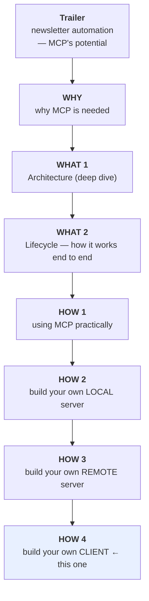
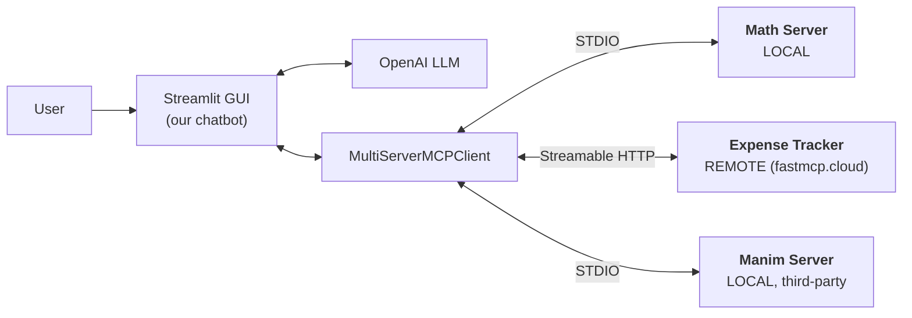
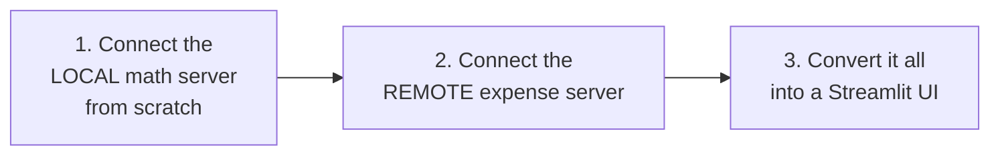
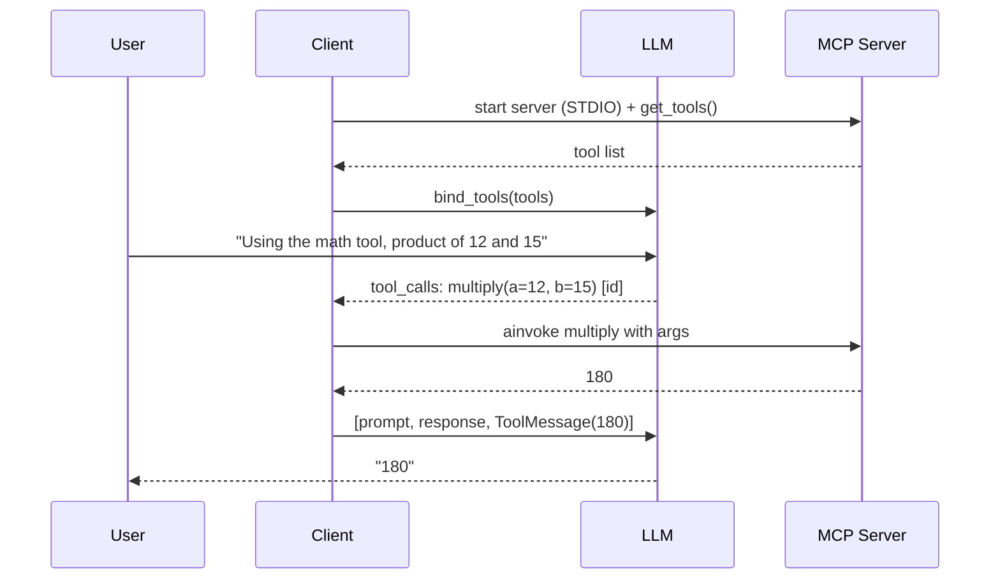

# Building Your Own MCP Client (LangChain MCP Adapters + Streamlit)

> **One-line summary:** The final piece of the puzzle — stop relying on Claude Desktop and build your own chatbot that connects to multiple MCP servers (local, remote, and third-party) using `langchain-mcp-adapters`, wrapped in a Streamlit GUI.

---

## Overview

### Where this sits

Seven videos in, the playlist has covered the whole **Why → What → How** arc:



### The gap this fills

Every server built so far needed **Claude Desktop** to use it — because Claude Desktop has a client inside it.

> **But what if you're building your own chatbot?** How do you connect *that* to an MCP server? That's today: **by making our own client.**

---

## Choosing a Library

Research turns up **multiple ways, multiple libraries**:

| Option | Notes |
|---|---|
| **The official MCP library** | Can build clients with it |
| **FastMCP** | The library covered in earlier videos — can also build clients |
| **`langchain-mcp-adapters`** | ← **chosen here** |

The adapters library describes itself as a **lightweight wrapper that makes MCP tools compatible with LangChain and LangGraph.**

### Why this one — two reasons

1. **It seemed the simplest way** to build MCP clients.
2. It's **closely connected to the LangChain/LangGraph universe**, which we've already been working with — so it'll be more useful going forward.

> Since you now know the concepts, you can very easily do the same work in the other two libraries.

---

## Today's Goal

Build an **MCP chatbot** where you can do normal chatting *and* talk to MCP servers attached behind the scenes.



Two servers to start with, deliberately chosen for **variety**:

| Server | Type | Whose |
|---|---|---|
| **Math** — arithmetic calculations | **Local** | Ours |
| **Expense Tracker** | **Remote** | Ours (deployed to FastMCP Cloud last video) |
| **Manim** — animation videos | **Local** | **Someone else's** (added later) |

### Plan of action



> And you can connect **as many other MCP servers as you like** — including everything shown across the playlist, e.g. the **Manim** server for beautiful visualizations, now attachable to *your own personal chatbot*.

---

# Part 1 — Connecting to a Local Server

## The server we're connecting to

A small **maths server** built earlier with FastMCP, doing arithmetic (add, subtract, multiply, divide, power, modulus). It sits on the Desktop — **which means it's a local MCP server.**

Quick sanity check before touching the client:

```bash
uv run fastmcp dev main.py       # opens MCP Inspector
# Connect → Tools → List Tools → six arithmetic operations
# modulus(21, 7) → Run Tool → 0  ✅
```

## Project setup

```bash
pip install uv                   # 1
# 2. create a new folder on the Desktop
# 3. open it in VS Code
uv init .                        # 4
uv add langchain langchain-openai langchain-mcp-adapters python-dotenv streamlit
```

| Dependency | Purpose |
|---|---|
| `langchain` | Core |
| `langchain-openai` | The LLM |
| **`langchain-mcp-adapters`** | **Builds the client** |
| `python-dotenv` | API key from `.env` |
| `streamlit` | The GUI, later |

## ⚠️ Prerequisite: async/await

> This entire codebase uses Python's **async/await** functionality. If you don't know async/await, watch a quick video first so this code makes better sense.

## The skeleton

```python
import asyncio
from langchain_mcp_adapters.client import MultiServerMCPClient

async def main():
    ...

if __name__ == "__main__":
    asyncio.run(main())
```

Why **`MultiServerMCPClient`**? Because we're going to connect this client to **multiple servers**.

## Step 1 — Server configuration

```python
servers = {
    "math": {
        "transport": "stdio",
        "command": "/absolute/path/to/uv",
        "args": [
            "run",
            "fastmcp",
            "run",
            "/Users/nitish/Desktop/mcp-math-server/main.py",
        ],
    }
}
```

> It looks scary, but **you've seen this before** — it's the same shape as the JSON you paste into Claude Desktop's config file to connect a local MCP server.

| Field | Meaning |
|---|---|
| `"math"` | A name we chose for the server |
| `transport: "stdio"` | Tells us this is a **local** MCP server |
| `command` + `args` | **The command to start that local server** — mentally, `uv run fastmcp run <path-to-main.py>` |

> ⭐ **Why a start command at all?** Recall from the architecture video: when communication happens over **STDIO** with local servers, **the client starts the server**. So we must hand it the command to do so.

## Step 2 — Create the client and fetch tools

```python
client = MultiServerMCPClient(servers)
tools = await client.get_tools()
print(tools)
```

Running this shows two things: first, **the client started the server** (transport STDIO), and then a big list — **the tools list** — with `add`, `subtract`, `multiply`, `divide`, `power`, and `modulus`.

## Step 3 — Restructure into a dictionary

The raw list is awkward. Convert it to `{tool_name: tool_object}`:

```python
named_tools = {}
for tool in tools:
    named_tools[tool.name] = tool
```

Now it's `{"add": <tool definition>, "subtract": <tool definition>, ...}` — much better structured, and this dictionary becomes important shortly.

> **Progress so far:** client connected to the server, all of the server's tools fetched and displayed.

## Step 4 — Bring in the LLM

Tools exist — but **who's going to use them? The answer is the LLM.**

```python
from dotenv import load_dotenv
from langchain_openai import ChatOpenAI

load_dotenv()                                   # reads OPENAI_API_KEY from .env

llm = ChatOpenAI(model="gpt-5")
llm_with_tools = llm.bind_tools(tools)          # ← the LIST, not the dictionary
```

> ⚠️ **Don't get confused:** `bind_tools` takes the **list** (`tools`), not the dictionary. The dictionary is for later.

## Step 5 — Prompt it

```python
prompt = "What is the product of 12 and 15"
response = await llm_with_tools.ainvoke(prompt)
print(response)
```

### 🔍 First surprise — no tool call

The response came back with **no `tool_calls`**. Why? Because this was a **simple calculation the LLM just did itself.**

Nudging it:

```python
prompt = "Using the math tool, what is the product of 12 and 15"
```

Now `content` is **empty** — which means a **tool call happened**:

```python
response.tool_calls
# [{'name': 'multiply', 'args': {'a': 12, 'b': 15}, 'id': 'call_abc123'}]
```

> **It's a list** because multiple tool calls can happen at once. Here just one: the LLM is telling us to call `multiply` with `a=12, b=15`.

## Step 6 — Actually invoke the tool

Right now we've only been *told* which tool to use with which input. **We still have to use it.**

```python
selected_tool      = response.tool_calls[0]["name"]
selected_tool_args = response.tool_calls[0]["args"]
selected_tool_id   = response.tool_calls[0]["id"]

tool_result = await named_tools[selected_tool].ainvoke(selected_tool_args)
print(tool_result)      # 180
```

> **This is where the dictionary earns its keep.** `named_tools[selected_tool]` looks up the actual tool object by the name the LLM gave us.

## Step 7 — Send the result back to the LLM

The last step: take the result, hand it back to the LLM, and say *"the tool gave this result — tell the user the answer."* That requires a **`ToolMessage`**.

```python
from langchain_core.messages import ToolMessage

tool_message = ToolMessage(
    content=tool_result,
    name=selected_tool,
    tool_call_id=selected_tool_id,      # ⚠️ REQUIRED
)

final_response = await llm_with_tools.ainvoke([
    prompt,           # the original question
    response,         # the LLM's reply saying "call multiply with these args"
    tool_message,     # what the tool actually returned
])

print(final_response.content)     # 180
```

> ⚠️ **The gotcha:** creating a `ToolMessage` **also requires the tool's ID**, available in the original response's `tool_calls`. Forgetting it throws an error. (And the parameter is named **`tool_call_id`**, not `id`.)

**Why pass all three?** We're passing the **entire history**: what was originally asked, what the LLM replied, and what the tool answered.

## The complete flow



---

## Improvement 1 — Handle "no tool needed"

Normal chatting should still work:

```python
prompt = "What is the capital of India"
```

💥 **The code breaks** — because no tool call happened, so all the downstream code was unnecessary.

**The fix — one `if` statement:**

```python
response = await llm_with_tools.ainvoke(prompt)

if not response.tool_calls:
    print(response.content)
    return                      # end the main function here

# ... otherwise, execute the tool-calling code below
```

```text
"What is the capital of India"                  → New Delhi ✅ (no tool)
"What is the remainder of 2314 divided by 7"    → tool call fires ✅
```

## Improvement 2 — Handle *multiple* tool calls

So far the code handles exactly **one** tool call. But the LLM may suggest **more than one**, and then the code fails.

**The fix — wrap the extraction and execution in a loop:**

```python
messages = [prompt, response]

for tool_call in response.tool_calls:          # ← loop over ALL of them
    selected_tool      = tool_call["name"]
    selected_tool_args = tool_call["args"]
    selected_tool_id   = tool_call["id"]

    tool_result = await named_tools[selected_tool].ainvoke(selected_tool_args)

    messages.append(ToolMessage(
        content=tool_result,
        name=selected_tool,
        tool_call_id=selected_tool_id,
    ))

final_response = await llm_with_tools.ainvoke(messages)
```

> **That's the only change** — the loop runs as many times as there are items in `response.tool_calls`. Now the LLM can ask for one tool or five, and it works either way.

---

# Part 2 — Adding a Remote Server

The remote server is exactly the **Expense Tracker** built and deployed to `fastmcp.cloud` in the previous video.

**The entire change:** add a second entry to the `servers` dictionary.

```python
servers = {
    "math": {
        "transport": "stdio",
        "command": "/absolute/path/to/uv",
        "args": ["run", "fastmcp", "run", "/Users/nitish/Desktop/mcp-math-server/main.py"],
    },
    "expense": {                                   # ← NEW
        "transport": "streamable_http",            # ← because it's REMOTE
        "url": "https://<your-server>.fastmcp.app/mcp",
    },
}
```

| Field | Local | Remote |
|---|---|---|
| `transport` | `stdio` | **`streamable_http`** |
| How to reach it | `command` + `args` (client starts it) | **`url`** (already running) |

**And that's it.** Nothing else to do.

## Verifying

Adding a small print of `named_tools.keys()` shows the tool list now contains **`add`, `subtract`, `multiply`… plus `add_expense`, `list_expenses`, `summarize`.**

> **Why?** Because our **MultiServerMCPClient is now connected to multiple servers.**

```text
Prompt: "Add an expense ₹800 for groceries on 4th November"
   → final response: "Your expense has been added"
     with date, category, and amount ✅
```

---

# Part 3 — Adding a Third-Party Server (Manim)

The **Manim** MCP server from the earlier video — the one that produces 3Blue1Brown-style animation videos. Previously connected to Claude Desktop; now we connect it to **our own client**.

> ⭐ **Why this example matters:** the two servers added so far were **built by us**. This is the first MCP server **someone else made** that we can use with our own client.

**Again, nothing new** — take the configuration shown in the earlier video and add it as-is, with `transport: stdio`, the server present on your machine, and the same commands and arguments passed verbatim.

```python
"manim": {
    "transport": "stdio",
    "command": "/absolute/path/to/python3",
    "args": ["/Users/nitish/Desktop/manim-mcp-server/src/manim_server.py"],
    "env": {"MANIM_EXECUTABLE": "/absolute/path/to/manim"},
}
```

```text
Prompt: "Draw a triangle rotating in place using the Manim tool"

   → tool list grows: execute_manim_code,
                      cleanup_manim_temporary_directory
   → wait...
   → 🎬 animation video generated ✅
```

> **The generalisable lesson:** pick up **any server from the internet** and you now know how to connect it to your client.

---

# Part 4 — The Streamlit GUI

Everything so far runs through the **terminal window**. The last improvement converts the logic into a **Streamlit app**.

```bash
streamlit run client2.py
```

> The Streamlit code isn't written from scratch on camera, deliberately: **this video isn't about how to build a GUI using Streamlit** — it's about building an MCP client. The two logics were merged, written descriptively with a chatbot's help, and the **logic is pretty much the same**.

Reading the file, the familiar parts are all visible in the same order:

| Section | Same as before? |
|---|---|
| The `servers` dictionary | **Identical** |
| Creating the chat LLM | Same |
| Creating the client | Same |
| Fetching the tools | Same |
| Everything else | Streamlit-specific |

> You need a little Streamlit knowledge to follow that file.

## Testing the GUI

```text
Normal chat                                     → works ✅
"Show me all the expenses from last two weeks"  → the groceries expense appears ✅
                                                   ⚠️ minor display issue: shows ₹800 oddly
"What is the remainder ... divided by 23"       → 13 ✅
"Make an animation video of a circle using
 the Manim tool"                                → 🎬 video ✅
```

> Three servers, one GUI chatbot — and **you now know how to add as many MCP servers as you want.**

---

# Comparison Tables

## Local vs remote server config in the client

| | **Local** | **Remote** |
|---|---|---|
| `transport` | `"stdio"` | `"streamable_http"` |
| Location field | `command` + `args` | `url` |
| Who starts the server | **The client** | Already running |
| Example | Math server, Manim server | Expense Tracker on FastMCP Cloud |

## The three client-building libraries

| | Official MCP library | FastMCP | **`langchain-mcp-adapters`** |
|---|---|---|---|
| Can build clients | ✅ | ✅ | ✅ |
| Chosen here | ❌ | ❌ | ✅ |
| Reason | — | — | **Simplest**, and plugs into the **LangChain/LangGraph** universe we already use |

## What each object is for

| Object | What it holds | Used for |
|---|---|---|
| `servers` (dict) | Configuration for every server | Creating the client |
| `MultiServerMCPClient` | The client itself | `get_tools()` |
| `tools` (**list**) | Raw tool objects | **`llm.bind_tools(tools)`** |
| `named_tools` (**dict**) | `{name: tool}` | **Looking up the tool the LLM chose** |
| `response.tool_calls` | `name`, `args`, `id` per call | Driving execution |
| `ToolMessage` | Result + name + `tool_call_id` | Feeding the result back to the LLM |

## The message history sent on the final call

| Position | What | Why |
|---|---|---|
| 1 | The original prompt | What was asked |
| 2 | The LLM's first response | Which tool it chose, with which args |
| 3 | `ToolMessage(...)` | What the tool actually returned |

---

# Common Pitfalls / Gotchas

- **Not knowing async/await.** The whole codebase depends on it. Learn it first or the code won't make sense.
- **Passing the dictionary to `bind_tools`.** It takes the **list**. The dictionary is only for looking up the chosen tool later.
- **Assuming a prompt will trigger a tool.** *"What is the product of 12 and 15"* was simple enough that the LLM just answered it. Nudging with *"using the math tool"* forced the call. Don't assume `tool_calls` exists.
- **No guard for the zero-tool-call case.** Ask a normal question and the downstream code breaks. One `if not response.tool_calls: ... return` fixes it.
- **Handling only one tool call.** `tool_calls` is a **list** — the LLM can request several. Loop over it.
- **Forgetting `tool_call_id` on the `ToolMessage`.** It's required, it lives in `response.tool_calls[0]["id"]`, and the parameter is named **`tool_call_id`** — not `id`, not `tool_id`.
- **Sending only the tool result back.** The LLM needs the **whole history** — prompt, its own response, then the tool message.
- **Forgetting the client starts local servers.** Under STDIO you must supply a working `command` + `args`, with **absolute paths**.
- **Using the wrong transport string.** `stdio` for local, `streamable_http` for remote. Mixing them up silently fails to connect.
- **Expecting flawless output.** The GUI showed a minor currency-rendering glitch (`₹800`). Small integration issues are normal.

---

# Key Concepts Worth Remembering

- **Claude Desktop has a client inside it.** Building your own chatbot means building your own client.
- **Three library options exist**; `langchain-mcp-adapters` is a **lightweight wrapper making MCP tools compatible with LangChain and LangGraph** — chosen for simplicity and ecosystem fit.
- **`MultiServerMCPClient`** — one client, many servers.
- **The server config dictionary is the same shape as Claude Desktop's JSON config.** You already know how to write it.
- **Local ⇒ `transport: stdio` + `command`/`args`** (the client starts the server). **Remote ⇒ `transport: streamable_http` + `url`.**
- **Two representations of the tools:** the **list** goes to `bind_tools`, the **dict** (`{name: tool}`) is for lookup at execution time.
- **The six-step flow:** connect → fetch tools → bind to LLM → prompt → read `tool_calls` → invoke the tool → **feed the result back via `ToolMessage`** → final answer.
- **`ToolMessage` needs three things:** `content`, `name`, and **`tool_call_id`**.
- **The final invoke takes the full history:** prompt + first response + tool message.
- **Guard for no tool calls**, and **loop over multiple tool calls**.
- **Adding a server = adding one dictionary entry.** Nothing else changes.
- **Any server from the internet works** — the Manim server proves it wasn't a trick that we'd written the first two ourselves.
- **The Streamlit layer changes nothing about the MCP logic** — servers dict, LLM, client, and tool fetching all stay identical.

---

# What's Left

The playlist's core is now complete: Why, What (Architecture + Lifecycle), and How (using MCP, local servers, remote servers, clients).

Still pending, to be covered later:

- **Sampling**
- **Elicitation**
- **Authentication** — including the unsolved multi-user isolation problem from the remote-server video

> The stated plan going forward: return to finishing the **LangGraph playlist** first — which is the reason this MCP series was started in the first place — then come back for these advanced topics.

---

# Summary

Building your own MCP client turns out to be a compact, six-step loop. Configure the servers in a dictionary that looks exactly like Claude Desktop's JSON config, hand it to a **`MultiServerMCPClient`**, call **`get_tools()`**, bind that list to an LLM, and prompt. When the LLM comes back with **`tool_calls`**, pull out the name, args, and **id**, look the tool up in a `{name: tool}` dictionary, invoke it, and wrap the result in a **`ToolMessage`** — remembering the mandatory `tool_call_id`. Then re-invoke the LLM with the **full history** (prompt + its response + the tool message) to get the natural-language answer.

Two robustness fixes turn the demo into something usable: an `if not response.tool_calls` guard so ordinary questions don't crash the pipeline, and a **loop** over `tool_calls` so the LLM can request several tools at once.

Scaling to more servers costs almost nothing — **one extra dictionary entry**. `stdio` with `command`/`args` for local servers the client must start; `streamable_http` with a `url` for remote ones already running. Adding the third-party **Manim** server proves the pattern generalises to anything on the internet, not just servers you wrote yourself. Wrapping the whole thing in **Streamlit** changes none of the MCP logic — the servers dict, the LLM, the client, and the tool fetching are all identical; only the interface differs.

Remaining for the future: **sampling, elicitation, and authentication** — the last of which is the key to fixing the multi-user problem left open when the Expense Tracker went remote.
